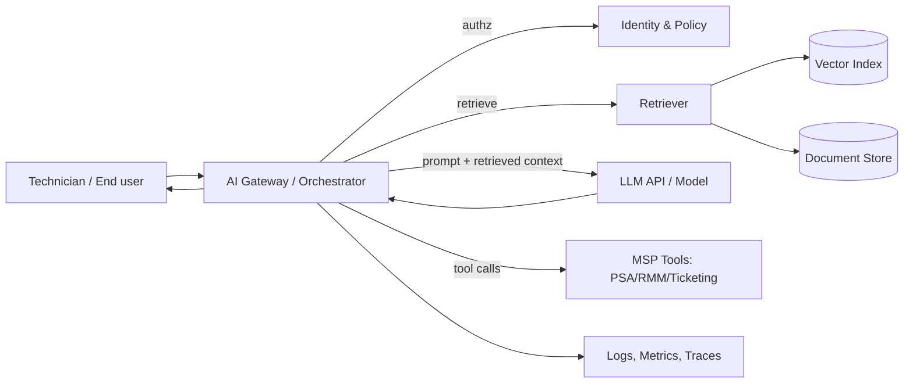
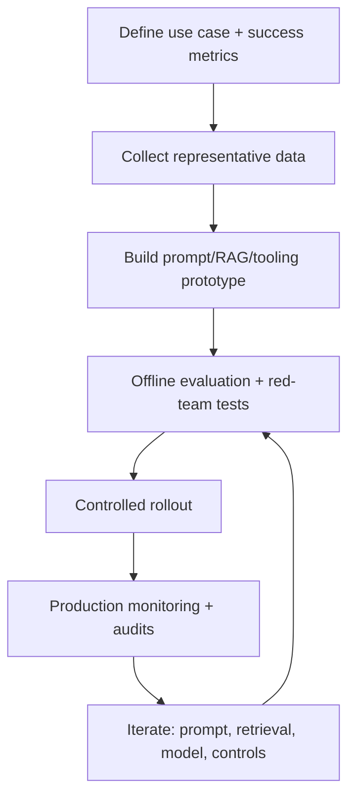

# AI Fundamentals for Managed Service Providers

## Executive summary

Managed Service Providers (MSPs) are in a strong position to productise AI because MSP work is already built on repeatable operations: service desks run on tickets and knowledge, NOCs run on alerts and runbooks, SOCs run on logs and playbooks, and every MSP stack is full of APIs that can be automated. AI, especially modern “LLM + retrieval + tools” patterns, slots into those workflows if you treat it like a controlled production system, not a magic chatbot. 

The fastest, lowest-drama adoption path for an MSP is to start with **retrieval-augmented generation (RAG)** and **workflow automation** rather than jumping straight to model training. RAG uses embeddings and vector search to pull relevant internal/customer documentation into the prompt context at runtime, which improves relevance and helps reduce hallucinations without changing model weights. Vendors now explicitly position RAG as the mainstream approach for grounding LLM responses in proprietary data.

The hard parts are not “AI ideas”. The hard parts are the same things that always bite MSPs: data access boundaries across tenants, identity and approvals, auditability, security, change management, and cost control. Current security guidance for LLM applications calls out risks like prompt injection, insecure output handling, training data poisoning, model denial of service, and supply chain weaknesses; you should assume these will show up in real client environments. 

A practical MSP AI practice can be built around a few repeatable service lines:

- **AI Service Desk Copilot**: ticket triage, summarisation, suggested responses grounded in KB/runbooks, and auto-drafting change plans.
- **AI NOC Triage**: alert enrichment, noise reduction, time-to-diagnosis reduction via runbook-guided reasoning and tooling.
- **AI SOC Assistant**: investigation summarisation, mapping to adversary techniques, faster reporting, and improved handoffs.
- **AI Governance and Safety Pack**: risk management, policies, evaluations, logging, and guardrails as managed services.

These map cleanly to established risk-management and cybersecurity frameworks, particularly the **entity["organization","National Institute of Standards and Technology","us standards agency"] AI RMF** and CSF for governance and security outcomes. 

For risk and compliance, treat AI systems as **socio-technical** (people + process + tech). That is the stance taken by NIST AI RMF, and it matters for MSPs because your solution is rarely “just a model”; it is also onboarding, access, SOPs, incident response, and continuous improvement. 

For global regulatory notes as of **15 Feb 2026 (Australia/Sydney)**: the EU AI Act is in force and is rolling out obligations in phases; official EU guidance states prohibited practices and AI literacy came into application from February 2025, general-purpose AI model obligations from August 2025, and broader application from August 2026 with some extended transitions (notably for certain high-risk systems embedded in regulated products). In parallel, there has been active policy work on simplifying timelines and obligations. You should design MSP offerings so they can meet the strictest plausible client requirement set without a rebuild. 

## AI fundamentals MSPs actually need

AI vocabulary is a mess in the market. For MSP work, don’t chase buzzwords. Learn the few concepts that determine architecture, cost, and risk.

**AI, ML, and DL (what matters operationally)**  
NIST defines AI as a machine-based system that can make predictions, recommendations, or decisions to meet human-defined objectives. Machine learning is a subset where systems learn patterns from data rather than being explicitly programmed for each rule; deep learning is a further subset that relies on multi-layer neural networks. This hierarchy is useful because it tells you whether your “AI feature” will behave like brittle rules (automation scripts), probabilistic models (ML), or high-capacity neural models (DL/LLMs) that require monitoring and safety controls. 

**Transformers, LLMs, and generative AI**  
Most modern LLMs are based on the Transformer architecture, introduced in “Attention Is All You Need”. This matters for MSPs because Transformers enable large-scale parallel training and strong language modelling, but they also tend to be **confident even when wrong**, which forces you to implement grounding and verification patterns in managed services. 

**Embeddings and vector search (the core of RAG)**  
Embeddings convert text (or other data types) into numeric vectors so that “semantic similarity” can be computed. That is why embeddings power document search, clustering, recommendations, and retrieval for RAG systems. In practice: you chunk documents, generate embeddings, store them in a vector index, and retrieve top-k chunks at query time. 

**RAG (retrieval-augmented generation)**  
RAG combines a generative model with retrieval from an external knowledge source; the retrieved content is injected into the prompt context so the model can answer with tenant-specific or environment-specific facts. Amazon explicitly describes this pattern for knowledge bases and (importantly for MSPs) positions citations/provenance as a way to check accuracy against the underlying source. 

**Fine-tuning (when you actually need it)**  
Fine-tuning adapts a pre-trained model to your task/domain by training it further on a smaller dataset. It can improve quality beyond prompt engineering and can reduce prompt length (cost and latency) by baking behaviour into weights. Some platforms implement efficient methods such as LoRA for fine-tuning to reduce complexity and cost. For MSPs, fine-tuning is usually a second-wave capability, after you have data controls and evaluation discipline. 

**Prompt engineering (and why it is not a “hack”)**  
Vendor guidance is consistent: prompt engineering is the discipline of structuring instructions and context to get reliable behaviour, and you must iterate, test, and constrain outputs for production use. AWS and Microsoft both publish prompting techniques and best practices, including specificity, constraints, and evaluation. 

**A practical mental model: “LLM + retrieval + tools + guardrails”**  
Modern MSP-grade implementations increasingly look like:

- an LLM for language reasoning and generation,
- retrieval for tenant-specific truth,
- tool calls for actions (PSA/RMM/ticketing/identity),
- guardrails/content safety to reduce harmful or risky outputs,
- logging/telemetry for audits and continuous improvement.

All major cloud AI platforms now expose pieces of this stack (agents, RAG/knowledge bases, safety filters/content safety). urn13search2

### RAG workflow diagram you can reuse with clients

This reflects the core RAG description used by vendors and the wider RAG research literature: retrieval from an external index augments generation for better factuality and traceability. 

### Decision criteria that MSPs should standardise

| Decision | Choose this when | Why it fits MSP delivery | Primary risks to manage 
|---|---|---|---|
| Prompting only | Task is simple, low-risk, and doesn’t require private knowledge | Fast to ship, low ops overhead | Hallucination, inconsistent outputs | 
| RAG | You must answer using client/MSP documentation that changes over time | Keeps truth in documents; easier updates than retraining | Data leakage across tenants, prompt injection via retrieved text | 
| Fine-tuning | You need consistent style/format or specialised behaviour not achieved by prompting/RAG | Can reduce prompt cost and improve latency | Data governance, evaluation debt, model leakage risks | 
| Custom ML model | You need predictions/optimisation (e.g., anomaly detection) beyond language tasks | Works well for monitoring and forecasting | Drift, retraining MLOps burden |

## MSP use cases and repeatable service patterns

The MSP value is not “we have AI”. The value is **reduced labour per ticket/alert**, consistent outcomes, and better risk posture. The patterns below are designed so you can sell, implement, and operate them repeatedly.

### Service pattern: AI Service Desk Copilot

**Use cases**
- Ticket intake summarisation, categorisation, priority suggestion.
- Drafted responses grounded in the client KB and current environment notes.
- Suggested runbook steps and change-plan drafts for approvals.
- Post-resolution knowledge capture: convert resolved tickets into KB drafts.

These are high-ROI because service desk work is text-heavy and repetitive, and RAG improves relevance by grounding responses in your KB/runbooks. 

**Step-by-step playbook**
- **Scope the “safe” actions first**: start with “read-only” assistance (summaries, suggested steps). Avoid direct execution until approvals and auditing are in place. 
- **Connect your KB sources**: ingest SOPs, runbooks, vendor docs you’re allowed to redistribute, and client-specific standard operating procedures; implement chunking and embedding generation. 
- **Implement tenant isolation**: separate indices per tenant or enforce strict metadata-based filtering with strong access controls; your default should be “assume breach” between tenants. 
- **Add guardrails/content safety**: configure harmful content filters and sensitive info handling where available; this is especially relevant for customer-facing chat and transcript summarisation. 
- **Introduce evaluation gates**: create a test set of real tickets and expected outcomes; run regressions when prompts, retrieval, or models change. This aligns with MLOps and GenAI operational guidance emphasising repeatability and lifecycle governance.  
- **Go live with clear disclaimers**: show citations to retrieved sources where feasible; force “I don’t know” behaviour when evidence is weak. This is consistent with both risk frameworks and practical prompting guidance. 

**Operational KPIs**
- Mean handle time (MHT) reduction.
- First contact resolution uplift.
- Ticket re-open rate.
- “Grounded answer rate” (answers with citations vs ungrounded).
- Escalation reduction (but do not optimise this blindly: suppressing escalations can hide risk). 

### Service pattern: AI NOC alert triage and automation

**Use cases**
- Alert enrichment: “what changed?”, “what is impacted?”, “what are the next 5 checks?”
- Noisy alert suppression suggestions (with human review).
- Auto-generated incident timelines and postmortem drafts.

This fits MSP ops because NOC data is structured but the *interpretation* is usually manual, and LLMs are strong at synthesis if you keep them grounded and instrumented. 

**Step-by-step playbook**
- **Normalise telemetry and context**: standardise logs/metrics/traces so your AI system can reliably ingest and correlate signals; OpenTelemetry is explicitly designed as a vendor-neutral framework for telemetry signals (logs, metrics, traces).   
- **Build “alert cards”**: create a canonical JSON schema for alerts (source, severity, topology, last-good state, recent changes, runbook link, owner). Use the LLM to summarise and propose next steps, not to decide unilaterally. 
- **Tool-calling with approvals**: if you enable actions (restart service, scale workload, block IP), enforce least privilege and explicit approval workflows because insecure output handling is a known LLM risk category. 
- **Measure**: track “time-to-triage” and “time-to-mitigate”; treat regressions as incidents (this is the operational posture promoted by MLOps lifecycle guidance). 

### Service pattern: AI SOC assistant

**Use cases**
- Summarise investigations and evidence into consistent incident reports.
- Map observed behaviours to adversary tactics/techniques for analyst context.
- Generate detection engineering ideas (rules, queries) as drafts for human review.

This is attractive, but it is also the fastest way to get hurt if you let the model become an untrusted “decision engine”. SOC workflows must remain auditable, and adversarial risk for AI systems is a real field with concrete attack taxonomies and threat matrices. 

**Step-by-step playbook**
- **Threat model the AI layer**: use adversarial ML references (attacker goals, lifecycle stages) and LLM-specific risk lists (prompt injection, data poisoning, etc.) to create your control plan. 
- **Ground the assistant on evidence**: responses should cite SIEM events, EDR alerts, and approved runbooks; avoid “freeform opinions”. This mirrors the rationale for RAG and traceability.   
- **Harden outputs**: never pipe LLM output directly into firewall rules, scripts, or remediation actions without validation; insecure output handling is explicitly called out by OWASP for LLM apps.  
- **Secure the model interface**: rate-limit and authenticate inference endpoints to reduce model theft and abuse; model extraction attacks via prediction APIs are well-established in academic literature.

### Packaging template: “AI readiness assessment” deliverable

Keep this simple and outcomes-based. Your assessment report should include:

- Current MSP stack integration map (systems of record, APIs, identity boundaries).
- Data classification (what is allowed into prompts/retrieval, what isn’t).
- Priority use cases ranked by ROI vs risk.
- Reference architecture choice (cloud vs hybrid vs on-prem).
- Governance and security control plan aligned to a recognised framework. 

## Architectures and integration with the MSP stack

You need a standard architecture that you can deploy for many customers with predictable support effort. That means: strong tenant isolation, consistent logging, clear integration boundaries, and predictable costs.

### Reference architectures MSPs can standardise

**Managed model hub (fastest to market)**  
Use a cloud provider’s managed foundation model access plus managed features (RAG/knowledge bases, agents, safety tooling). This reduces undifferentiated heavy lifting and aligns with the MLOps idea of reusing platform capabilities where possible.

- AWS example: knowledge bases for RAG and guardrails for filtering/sensitive info controls are first-class features in the platform’s documentation. 
- Microsoft example: the platform positions an agent runtime that orchestrates tool calls and integrates with identity, networking, and observability. 
- Google example: documentation highlights responsible AI controls (content filtering and safety attributes) and supports embedding model tuning and generative AI pricing models.

**Hybrid (common for regulated clients)**  
Keep sensitive data and retrieval stores in a controlled environment (private network, client-controlled keys), while still consuming managed LLM APIs if policy allows. This is often a pragmatic compromise when GDPR/HIPAA-like constraints apply, because you can strictly limit what data leaves the environment and maintain retention controls. 

**On-prem/self-hosted (highest control, highest ops burden)**  
Run models and vector search on your own infrastructure, typically on Kubernetes. Kubernetes is explicitly described as an open-source platform for managing containerised workloads with declarative configuration and automation, which makes it the default substrate for portable AI platforms. Expect significant operational overhead: GPUs, patching, scaling, and security hardening become your problem.

### Integration patterns you can reuse across toolchains

**Pattern: “AI gateway” in front of your MSP stack**  
Put an AI gateway/orchestrator between user channels and your tools. The gateway:

- authenticates users and enforces authorisation,
- selects the right tenant context,
- performs retrieval (RAG),
- calls the model,
- optionally calls tools (PSA/RMM/ticketing),
- logs everything.

This design makes auditing and policy enforcement practical, which is consistent with the AI RMF focus on accountability, transparency, and traceability. 

**Pattern: event-driven enrichment**  
Instead of “chatbot-first”, enrich existing workflows: when a ticket is created or an alert triggers, publish an event, attach AI-generated summaries and recommended runbooks, and let humans act. This reduces blast radius and aligns with OWASP guidance that warns about insecure output handling when LLM output is piped into downstream systems without validation. 

**Pattern: tool-calling with strict contracts**  
If the model can call tools, treat each tool as a mini API product:

- strict schema for inputs/outputs,
- allow-lists for actions,
- approvals for high-risk steps,
- idempotency and rollback,
- full audit logging.

This mirrors secure software lifecycle recommendations and reduces the chance that prompt injection or output issues lead to real-world damage. 

### Multi-tenant design rules that MSPs should not compromise on

- **Tenant isolation by default**: separate indices/stores per tenant or enforce unbypassable metadata filtering with central policy enforcement. If you cannot clearly prove isolation, you are one prompt injection away from a cross-tenant data breach. 
- **Centralised logging and trace correlation**: you need end-to-end traces for AI requests, retrieval sources, tool calls, and outputs; OpenTelemetry explicitly targets correlation of logs/metrics/traces with resource context. 
- **Evidence-first outputs**: where practical, require citations to retrieved sources; vendors explicitly describe citation support as a way to check accuracy, and RAG literature motivates retrieval partly to improve factual grounding. 

## Data governance, security, and compliance

If you want to sell AI services credibly, you need a governance story that survives procurement, security review, and incident response.

### Governance frameworks you can align to without reinventing the wheel

- **ISO AI management system**: **entity["organization","International Organization for Standardization","standards body"] ISO/IEC 42001 defines requirements for establishing, implementing, maintaining, and continually improving an AI management system. For MSPs, this becomes the backbone for your internal AI practice and your customer-facing governance pack.
- **AI risk management guidance**: ISO/IEC 23894 provides guidance on managing AI-specific risks and integrating risk management into AI activities across the lifecycle. This complements NIST AI RMF and is a useful bridge when clients prefer ISO language.
- **NIST AI RMF and GenAI profile**: AI RMF 1.0 defines trustworthiness characteristics and the “govern/map/measure/manage” functions; the GenAI profile adds generative-specific risk categories and recommended actions. These are practical for MSPs because they translate well into managed control sets and checklists.  
- **Cybersecurity baseline**: NIST CSF 2.0 provides cybersecurity outcomes (Govern, Identify, Protect, Detect, Respond, Recover). Use it to anchor your AI service’s security controls into the same language clients already use. 

### Data management and governance controls MSPs should implement

**Data pipeline basics (for RAG and fine-tuning)**  
At minimum, you will manage: ingestion, cleaning, chunking, embedding generation, indexing, retrieval, and re-indexing when documents change. Each of these steps becomes part of your service reliability and must be versioned and monitored as part of operational discipline. 

**Provenance and traceability**  
NIST explicitly highlights maintaining training-data provenance and supporting attribution of outputs to subsets of training data as helpful for transparency and accountability. For MSPs, translate this into: “we can show which documents and which versions were used to answer this ticket.”

**Labelling and data preparation (when you do ML or tuning)**  
If you move beyond RAG into fine-tuning or classical ML, high-quality labelled data becomes a gating factor. All major clouds provide data labelling capabilities (SageMaker Ground Truth, Vertex AI data labelling workflows, Azure ML data labelling). Use these as reference implementations for your internal processes, even if you outsource the work. 

**Retention and privacy (global baseline)**  
A workable global baseline is to design around the strictest common privacy principles: purpose limitation, data minimisation, and retention limits, which sit at the heart of GDPR processing principles. Even if your client is not in the EU, these principles are increasingly expected by procurement and regulators globally. 

**Australia-specific note**  
If you operate under the Privacy Act and the Notifiable Data Breaches scheme, data breaches involving personal information that are likely to result in serious harm must be notified to affected individuals and the regulator. For MSPs, your AI logs, prompts, and retrieval stores are now part of the potential breach surface, so incident response plans must include them. 

**HIPAA note (if you serve healthcare clients)**  
HIPAA privacy and security obligations apply to protected health information and electronic protected health information, with required administrative, physical, and technical safeguards. If you serve covered entities or business associates, you must treat prompts, retrieval stores, and outputs that contain PHI as in-scope systems. 

### Security threats MSPs must assume will happen

The security posture of AI services is not theoretical. Treat it like any other internet-exposed system, plus AI-specific attacks.

**Prompt injection and indirect prompt injection**  
Prompt injection is listed as the top risk in OWASP’s Top 10 for LLM applications; it can lead to unauthorised actions, data exposure, or compromised decision-making. Indirect prompt injection occurs when malicious instructions are embedded in retrieved documents or tool outputs. For MSPs, this is why tenant filtering plus tool-call gating is non-negotiable.

**Insecure output handling**  
OWASP explicitly calls out insecure output handling: if you treat model output as trusted and feed it into downstream systems (scripts, config changes, tickets, firewall rules), you can create code execution or privilege escalation paths. MSP automation often sits exactly on that cliff edge. 

**Data poisoning and adversarial ML**  
NIST’s adversarial ML taxonomy covers poisoning, evasion, privacy attacks, and abuse categories. Practical MSP translation: attackers can poison fine-tuning datasets, inject malicious content into knowledge bases, or manipulate inputs to degrade detection and response workflows. 

**Model theft and privacy leakage**  
Model extraction attacks against prediction APIs are well-documented, and membership inference attacks show how models can leak information about whether a record was in the training set. Even if you are “just using APIs”, your fine-tuned models, prompts, tool schemas, and retrieval indices can be valuable IP and targets. 

**Supply chain risk**  
AI systems increase supply chain complexity: models, SDKs, vector databases, prompt frameworks, and third-party connectors. Use secure software development guidance (SSDF) to formalise controls like dependency management, build integrity, vulnerability handling, and supplier oversight. 

**Threat modelling resources**  
Use MITRE’s ATLAS as a living knowledge base of adversary tactics and techniques for AI-enabled systems; it’s specifically designed to expand traditional threat modelling into AI attack surfaces. 

### Security control checklist for MSP AI services

Use this as a baseline in every statement of work and internal deployment runbook.

- **Identity and access**
  - Least-privilege access for tool-calling identities.
  - Separate identities/keys per tenant and environment (dev/test/prod).
  - Strong authn/authz on inference endpoints and retrieval APIs. 
- **Data protection**
  - Clear “allowed vs disallowed” data classes for prompts and retrieval.
  - Encryption and key management aligned to your security management system baseline.
  - Retention controls for prompts, logs, and retrieved snippets. 
- **App and model safety**
  - Input validation and output validation.
  - Tool-call allow-lists and schema validation.
  - Prompt injection testing as part of release gates (OWASP LLM guidance).
- **Observability and audit**
  - Trace IDs across requests, retrieval, and tool calls.
  - Tamper-evident logging for security events.
  - Monitoring for abuse patterns (bursting, scraping, unusual prompt types).  
- **Supplier and dependency controls**
  - SBOM and dependency scanning for your AI gateway and connectors.
  - Patch and vulnerability response SLAs.
  - Documented release process (SSDF). 

### Compliance and ethics notes you should explicitly address in offerings

**Explainability and transparency**  
NIST publishes principles for explainable AI and positions explainability as a key element of trustworthy AI. For MSPs, “explainability” often means: auditable retrieval citations, clear reasoning steps in runbooks, and the ability to justify actions taken (or recommended) by automation. 

**Bias and fairness**  
NIST SP 1270 frames bias as an AI lifecycle risk and provides guidance for identifying and managing it. MSP translation: if you use AI to prioritise tickets, recommend security actions, or decide escalation paths, you must check for systematic harmful bias and document mitigations. 

**EU AI Act operational reality**  
Official EU guidance describes a risk-based regime with prohibited practices, high-risk obligations (including data quality, logging, documentation, human oversight, robustness/cybersecurity), and transparency obligations for certain AI interactions. If you serve EU customers, your service design must support documentation, logging, and oversight as first-class requirements, not “nice to have”. 

## Operationalising AI

MSPs win or lose on operations. That includes model lifecycle, prompt lifecycle, retrieval lifecycle, and incident management.

### MLOps and GenAIOps foundations you should adopt

**Use an established lifecycle model**  
Microsoft’s MLOps v2 pattern describes modular phases including data estate, administration/setup, model development, and model deployment. Google’s guidance emphasises CI/CD/CT (continuous training) for ML systems. Even if your first services are “just RAG”, you still need a lifecycle because your prompts, retrieval indices, and evaluation sets change over time. 

**Maturity matters**  
MLOps maturity models are explicitly intended to help organisations evolve capability gradually and set realistic success criteria. MSP take: bake “maturity upgrades” into your managed service tiers (basic monitoring vs full retraining/evaluation automation). 

**Model and pipeline governance**  
Model management guidance highlights versioning, lineage, deployment tracking, and monitoring for data drift and lifecycle events. That governance posture is exactly what you need to be credible in regulated and security-conscious environments. 

### What to monitor in production LLM/RAG services

At minimum, monitor four categories.

**Quality**
- Grounded answer rate (answers supported by retrieved sources).
- Hallucination rate via test prompts and regression suites.
- Retrieval quality (recall/precision proxies such as “did the correct doc appear in top-k?”).  

**Security**
- Prompt injection attempts.
- Tool misuse attempts.
- Cross-tenant access anomalies.
- Data exfiltration patterns (large outputs, repeated retrieval queries). 

**Reliability and cost**
- Latency (p50/p95).
- Token/character consumption by route (prompt, retrieved context, output).
- Cache hit rates (where supported).
- Failure modes (timeouts, safety blocks). 

**Operations**
- Change events: new documents, re-index jobs, prompt version changes, model version changes.
- Incident outcomes: false positives/negatives in triage, escalation accuracy. 

### Continuous improvement workflow

This loop aligns with established MLOps guidance around repeatable pipelines, monitoring, and iterative improvement, and it aligns with risk frameworks that treat AI risk management as continuous rather than one-off. 

### Implementation timeline and resource estimates

The table below is a **planning example** for an MSP building an internal capability and launching the first client service line. Real timing depends on your stack complexity, client requirements, and whether you use managed services or self-hosted infrastructure.

| Workstream | Typical deliverables | Timebox (planning example) | People (planning example) | Notes |
|---|---|---:|---:|---|
| Foundations | AI policy, risk controls baseline, tenant isolation approach, logging standards | 2–4 weeks | 1 solution architect, 1 security lead | Use NIST AI RMF + CSF + SSDF as the “spine” to avoid reinventing controls.|
| Platform build | AI gateway, retrieval pipeline, vector index, CI/CD, telemetry | 4–8 weeks | 2 engineers, 1 platform/DevOps | Follow MLOps v2 and cloud MLOps guidance for repeatable delivery.|
| First service line | Service Desk Copilot (read-only assist), evaluation suite, go-live kit | 4–6 weeks | 1 engineer, 1 service desk SME, 0.5 security | Use RAG and best-practice prompting guidance.  |
| Harden and scale | Guardrails, incident handling, cost controls, client onboarding templates | 4–8 weeks | 1 engineer, 1 security, 0.5 service delivery | Use OWASP LLM Top 10 and platform guardrails/content safety tools. |

## Tooling landscape, service models, pricing, and go-to-market

### Cloud and vendor landscape comparison

This table focuses on what MSPs care about: managed model access, RAG support, safety features, and operational fit. It intentionally avoids claiming “best model quality” because that changes constantly and is workload-specific.

| Category | entity["company","Amazon Web Services","cloud provider"] | entity["company","Microsoft Azure","cloud platform"] | entity["company","Google Cloud","cloud platform"] |
|---|---|---|---|
| RAG / knowledge grounding | Knowledge base feature described as implementing RAG and supporting citations to source data.  | Embedding model tuning docs and responsible AI guidance (incl. safety filters).  |
| Fine-tuning support | (Varies by model/provider; evaluate per service and region.) | Fine-tuning guidance includes LoRA approach and model customisation workflows.  |
| Safety controls | Guardrails docs describe content filtering and sensitive info handling.  | Responsible AI doc describes safety attribute scoring and configurable filters.  |
| Pricing model signals | Token-based pricing is published for model usage (varies by model/provider/region).  |

### Security and risk tooling references you can standardise on

Use well-recognised, defensible references so your controls are explainable in audits.

- **OWASP LLM Top 10** (LLM app-specific vulnerabilities and mitigations).   
- **MITRE ATLAS** for AI threat modelling and red teaming reference.   
- **NIST AI 100-2** for adversarial ML taxonomy and terminology.   
- **NIST SSDF** for secure software supply chain and development practices.   
- **NIST AI RMF + GenAI profile** for end-to-end AI risk management actions. 

### MSP service models and pricing strategies

AI services are usually a blend of **managed labour** and **usage-based vendor costs**. Cloud AI pricing is typically metered (tokens/characters), so if you don’t pass through usage costs carefully, margins will evaporate. 

| Model | How you charge | Where MSP margin comes from | When it works | Where it fails |
|---|---|---|---|---|
| Fixed monthly per user/device | Bundle an AI feature set into existing support tiers | Reduced labour per ticket, higher customer stickiness | Stable usage, predictable scope | High-variance usage can destroy margins without fair-use limits.  |
| Consumption pass-through + management fee | Pass vendor AI usage directly, add a platform/ops fee | Ops excellence and optimisation | Clients accept variable bills | Procurement friction; requires strong visibility and reporting.  |
| Project + managed ops | One-off build, then monthly for monitoring/evals/updates | Delivery + ongoing lifecycle services | Larger clients, regulated environments | If you don’t standardise, every client becomes bespoke.  |
| Outcome-based (careful) | Charge per resolved ticket, per triaged alert, etc. | If you can truly measure outcomes | High maturity clients | Risky if data quality and processes aren’t controlled.  |

#### Pricing example templates (numbers are illustrative)

Because vendor prices vary by model/region and change over time, don’t anchor your offer on “$X per month including unlimited AI”. Anchor it on a structure:

- **Base platform fee** (covers AI gateway, retrieval, logging, evaluation, guardrails configuration, support).
- **Usage pass-through** for token/character consumption (with reporting).
- **Optional add-ons**: 24×7 monitoring, red teaming, compliance documentation packs, fine-tuning pilots. 

### Go-to-market packaging templates you can copy

**Offer: AI Readiness and Governance Pack**
- Deliverables: risk assessment aligned to AI RMF, data classification rules, retention policy for prompts/logs, incident response additions for AI systems, supplier questionnaire for AI vendors. 

**Offer: Managed RAG Knowledge Assistant**
- Deliverables: tenant-scoped knowledge base ingestion, embeddings pipeline, retrieval evaluation, citations enabled, content safety/guardrails configuration, monthly quality report. 

**Offer: Service Desk Copilot**
- Deliverables: ticket summarisation and suggested replies grounded in KB, rollout playbook, measurable KPIs, model/prompt change management process. 

**Offer: SecOps AI Assistant**
- Deliverables: SOC summarisation and reporting, threat modelling pack, prompt injection test suite, secure tool-calling patterns, and audit logging. 

### Staff skills and training roadmap

You do not need everyone to become a data scientist. You need a small number of people who can design systems responsibly, plus process training for the wider team.

**Core roles MSPs should define**
- AI solution architect (reference architectures, integration patterns, cost design).
- AI security lead (threat modelling, controls, red teaming, incident response).
- ML/GenAI engineer (RAG pipelines, evaluations, prompt/tool schemas).
- Service SME leads (Service Desk, NOC, SOC) to encode runbooks and acceptance criteria. 

**Training progression**
- Start with foundational definitions and risk framing (NIST AI RMF and trustworthiness characteristics).   
- Train prompting and system message design using vendor guidance (AWS and Microsoft prompt engineering).   
- Build operational discipline using MLOps guidance (MLOps v2, continuous delivery pipelines, monitoring).   
- Security-specific: adopt OWASP LLM Top 10 and MITRE ATLAS for test planning and red teaming.   

### Final checklists to operationalise as SOPs

**Pre-sales qualification checklist**
- Client data sensitivity and jurisdictions (GDPR/HIPAA/AU Privacy Act exposure).   
- Tenant separation expectations and audit requirements.   
- Clear “human-in-the-loop” commitments for actions.   

**Go-live checklist**
- Threat model completed (OWASP + adversarial ML references).   
- Evaluation set built and regression gates in CI/CD.   
- Observability: logs/metrics/traces correlated end-to-end.   
- Retention and incident response updated to include AI artefacts.   

**Monthly service review checklist**
- Cost per ticket/alert vs baseline; usage trends.   
- Quality drift: retrieval relevance, groundedness, failure modes.   
- Security review: injection attempts, abuse patterns, tool-call anomalies.   
- Governance: documentation updates for models/prompts and significant changes. 