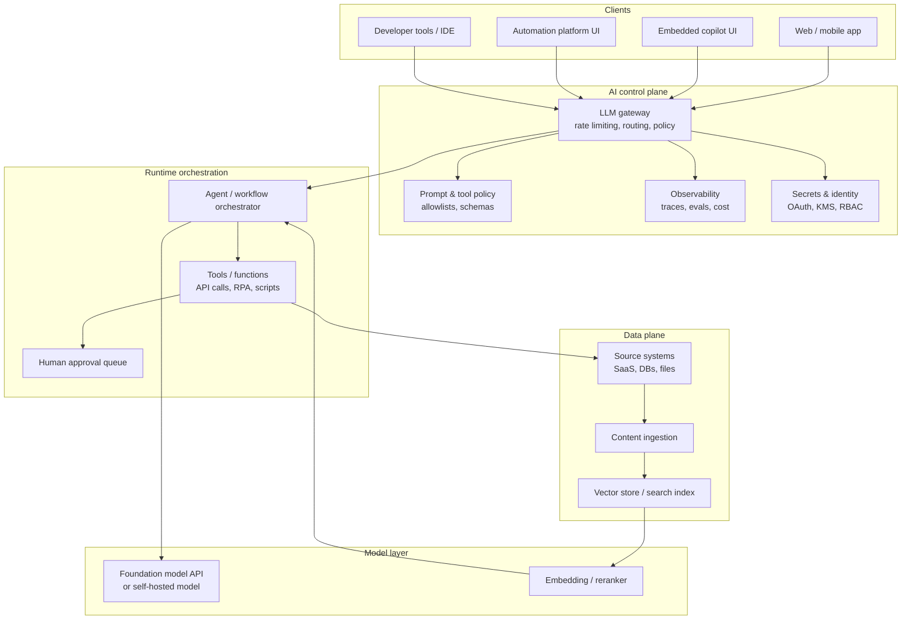

# The AI landscape in early 2026

## Executive summary

The current AI landscape is no longer “one market”. It is a stacked ecosystem with four layers that interact but optimise for different outcomes: foundation models (capability and unit economics), embedded copilots (distribution and workflow proximity), automation platforms (connectivity and operationalisation), and agent frameworks (developer control and reliability). This stack is now converging on a small set of architectural primitives: retrieval-augmented generation (RAG), tool or function calling, prompt caching and batch execution for cost and latency, and end-to-end tracing as a baseline for production reliability. 

In foundation models, the competitive pattern is clear: closed-weight frontier models drive peak quality and broad modality, while open-weight models drive deployment flexibility and data control, but introduce licensing and supply-chain complexity. This is not a philosophical debate. It is a procurement trade: closed-weight models buy you managed scaling, rapid feature velocity, and vendor tooling; open-weight models buy you on-prem and edge options, predictable data locality, and custom fine-tuning, in exchange for higher engineering and MLOps burden. 

Embedded copilots in productivity suites (notably Microsoft 365 and Google Workspace) have shifted from “nice chat UI” into a distribution channel for enterprise search and action-taking agents. Their differentiator is not model IQ alone. It is identity, permissions, and proximity to organisational data. Both vendors emphasise that organisational controls and tenant boundaries continue to apply, and that customer Workspace or tenant data is not used to train models outside the customer domain without permission. 

Automation platforms have moved from linear workflows (trigger → actions) to “agentic automation”, where an LLM decides which actions to take across connected systems, often with knowledge sources attached. This matters operationally: the limiting factor becomes governance and blast radius control (what tools can be called, on what data, with what approvals), not whether you can call an API. 

Agents are the most over-hyped and most real category at the same time. The winning patterns are pragmatic: constrained tool use, strong observability, explicit state management, and cheap re-use of stable prompt prefixes via caching and batch execution. Frameworks and standards are converging around these needs. The Model Context Protocol (MCP) is a notable step toward standardising tool and data connections (reducing N×M integration sprawl), but it expands the attack surface and must be treated as security-sensitive infrastructure. 

Regulation and governance pressure is now a first-order design input. The EU AI Act has a phased timeline, with prohibited practices and AI literacy obligations applying from February 2025, obligations for general-purpose AI models applying from August 2025, and full applicability from August 2026 (with some high-risk transitions out to 2027). Australia’s public sector has tightened mandatory governance requirements for government use of AI from December 2025, and industry guidance has matured into practical guardrails. These timelines are close enough to affect architectures being designed today. 

## Landscape map and reference architectures

A useful way to think about the stack is “capability placement”: where intelligence lives, where data lives, and where actions execute. The macro-trend is that intelligence is increasingly accessed as an API or embedded copilot, while data and actions remain distributed across SaaS, internal systems, and endpoints. Agent frameworks and automation platforms fill the gap by orchestrating tool calls, retrieval, and approvals across those systems. 

### Category boundaries that matter in practice

Foundation models deliver the “token engine”. They are usually consumed through hosted APIs, but open-weight models can be deployed on your own infrastructure. Managed clouds now bundle additional primitives: web search, file search, computer use, and managed prompt caching or throughput reservation. 

Embedded copilots sit inside high-frequency workflows (email, docs, meetings, chat). Their technical value is twofold: they inherit enterprise identity and authorisation models and they can ground responses in the organisation’s indexed content. For example, Microsoft’s Copilot architecture explicitly references grounding via Microsoft Graph and semantic indexing. 

Automation platforms specialise in connectors, workflow state, retries, governance, and human-in-the-loop. They increasingly expose LLM-driven “agents” on top of these primitives, which is a natural evolution because automation platforms already know how to safely execute actions across third-party systems. 

Agent frameworks and standards (LangChain/LangGraph, Semantic Kernel, MCP, vendor SDKs) provide programmable control over multi-step reasoning and tool use. Their differentiator is engineering ergonomics and reliability: state, memory, tool schemas, evaluation harnesses, and traces. 

### Reference architecture for an enterprise “AI capability plane”

The following mermaid diagram captures a vendor-agnostic architecture that is showing up repeatedly in production systems.

This architecture is aligned with the way major vendors describe modern agentic systems: built-in tools and multi-turn orchestration (OpenAI Responses/Agents), searchable organisational grounding (Microsoft semantic indexing/Copilot architecture), and standardised tool connectivity (MCP). 

## Foundation models

### Vendor and model-family comparison

The foundation model market can be summarised by three procurement levers: (1) capability envelope (reasoning, code, multimodal, context length), (2) deployment and governance (API hosting, cloud intermediaries, self-host), and (3) unit economics (token pricing, caching, batching, throughput guarantees). 

Table: selected foundation model families and practical implications (early 2026)

| Provider / family | Access model | Deployment options | Pricing signals (examples) | Notable governance / licensing constraints | Strengths | Weaknesses / risks |
|---|---|---|---|---|---|---|
| OpenAI (GPT + o-series) | Hosted API with built-in tools (Responses, Agents SDK) | Cloud API; also via cloud intermediaries (e.g., Azure-hosted variants) | Example token prices include GPT-5 family and o-series, with separate tiers for priority and batch; prompt caching and batch are supported for cost/latency optimisation.  | API data not used for training by default; default retention for abuse-monitoring logs up to 30 days, with controls and possible zero-retention requests depending on offering.  | Fast product surface evolution (tools, agent SDKs, multimodal, caching) and strong developer experience | Closed weights: limited on-prem/edge; vendor dependency; model lifecycle churn can force upgrades and retesting  |
| Anthropic (Claude: Haiku/Sonnet/Opus) | Hosted API; also distributed via major clouds; strong features for tool use, caching, batch | Cloud API; availability through major cloud platforms is explicitly stated | Public pricing examples include Sonnet at $3/$15 per MTok and Opus at $5/$25 per MTok; batch processing is discounted and prompt caching is supported.  | Consumer policy has evolved, with opt-in/out mechanics and retention differences; commercial/API offerings are typically positioned with stronger controls and no training by default claims.  | Strong long-context workflows and tool-use ergonomics (prompt caching, batch) | Closed weights; policy and retention differences between consumer and enterprise require careful separation and contract review  |
| Google (Gemini API; Workspace Gemini; Vertex AI models) | Developer API + cloud platform; embedded suite products | Cloud API; managed guarantees (e.g., Vertex AI) plus enterprise controls | Gemini API pricing includes per-MTok rates, batch discounts, context caching charges, and separate grounding rates.  | Training restriction and zero-data-retention options are documented for Vertex AI; Workspace commitments state no training outside domain without permission.  | Tight integration with enterprise productivity and Google ecosystem; explicit pricing for caching and grounding | Complexity across consumer vs enterprise surfaces; prompt injection and “hidden instruction” risks are salient in email-style workloads  |
| Meta (Llama open-weight family) | Open-weight distribution with community licence | “Deploy anywhere” positioning, including on-prem and edge, subject to licence | No per-token API by default (your infra cost); inference cost depends on your deployment | Community licence includes “additional commercial terms” including an MAU threshold clause; licence obligations apply to derivatives and redistribution.  | Strong flexibility: self-host, fine-tune, distil, data locality | You own ops and safety; licence constraints can be non-trivial for very large consumer services; supply-chain and model provenance controls become your responsibility  |

### Architectural capabilities that matter (not marketing checklists)

**Tool use and orchestration are now first-class.** Foundation models increasingly assume they will call tools rather than “answer everything from weights”. The research lineage is clear: Toolformer demonstrated that models can learn when and how to call external tools, and modern APIs now standardise tool calling and multi-turn orchestration. 

**RAG is production-standard, but it increases the attack surface.** RAG reduces hallucination by grounding outputs in retrieved content, but it introduces new privacy and integrity risks, such as membership inference against the retrieval corpus and poisoning of retrieved documents. Recent work proposes formal threat models and taxonomies for these RAG-specific risks, and OWASP explicitly treats prompt injection and insecure output handling as top-tier risks in LLM apps. 

**Caching and batch are now core FinOps controls.** OpenAI’s prompt caching is positioned as automatic and can reduce latency and input cost materially; Anthropic and major cloud platforms also offer prompt caching and batch processing with explicit discounts. These features change the feasible architecture for agents (many calls, long prompts), making “agentic” systems less financially terrifying if engineered correctly. 

### Deployment models and where they actually fit

**Cloud API (managed inference)** is still the default for most teams because it compresses time-to-value: you get scaling, upgrades, safety patches, and tooling, and you avoid GPU supply chain issues. The trade is vendor dependency and data residency constraints that must be contractually and technically managed. 

**Cloud intermediaries (Bedrock, Azure-hosted variants, Vertex AI partner models)** exist largely to satisfy enterprise procurement: consolidated billing, IAM integration, private networking, and region controls, sometimes plus throughput reservation. AWS explicitly documents pricing based on tokens and provisioned throughput, and Bedrock supports prompt caching for lower latency and cost. 

**On-prem and edge** are mostly driven by two requirements: hard data residency or latency constraints, and the need for deep customisation. Open-weight models make this feasible, but the operational risk is real: model updates, safety tuning, and evaluation become your problem, and the licence can impose constraints that some teams discover late (which is procurement malpractice). 

## Embedded copilots and suite AI

Embedded AI is “AI with distribution”. The product strategy is to put a conversational interface directly inside high-frequency work surfaces, then ground it in the organisation’s data and permissions, and increasingly let it take actions (agents) via controlled connectors. 

### Microsoft 365 Copilot and Copilot Studio: architectural posture

The technical story is grounded search plus permission trimming. Microsoft documentation describes Copilot preprocessing prompts using grounding and accessing Microsoft Graph within the user’s tenant, and semantic indexing maps organisational data to improve retrieval relevance. 

There are two practical deployment models:

- **Copilot as suite feature**: Copilot Chat is positioned as included for eligible Entra users with a qualifying subscription, while “agents” can require an Azure subscription and are metered.   
- **Copilot Studio as agent platform**: Copilot Studio supports pay-as-you-go and prepaid credit packs, with credits consumed per agent action/response. Microsoft’s pricing and licensing materials make it explicit that this is designed for variable consumption and that an Azure subscription is required for agent usage. 

This separation matters for architects because it defines governance boundaries: suite copilots inherit Microsoft 365 security and compliance controls; studio-built agents introduce a programmable action surface that must be threat-modelled like any integration platform. 

Commercial reality is also part of the “landscape”: bundling AI into subscriptions has triggered consumer scrutiny in Australia. The ACCC alleges Microsoft communications presented users as having only two options (pay more or cancel) while a “Classic” option existed, highlighting how AI bundling can create legal and reputational risk if product changes are not transparently communicated. 

### Google Workspace with Gemini: architectural posture

Google’s enterprise posture emphasises tenant boundaries and that existing Workspace security controls apply. The Google Workspace privacy hub states that Gemini interactions stay within the organisation and that chats and uploaded files are not used to train models outside the domain without permission, and Google’s Workspace AI privacy overview states Workspace customer data is not used to train models outside Workspace without permission. 

For Google Cloud developers, Vertex AI documents training restrictions and zero data retention options, with explicit language that Google won’t use customer data to train or fine-tune models without permission or instruction. 

### Embedded AI threat model: why this category is uniquely risky

Embedded copilots ingest content that was not authored as “instructions”. That is exactly the condition for indirect prompt injection. The academic literature explicitly shows that LLM-integrated applications blur the line between data and instructions, and indirect prompt injection can manipulate tool calls and exfiltrate data. 

This threat is not theoretical. Reporting on Gemini for Workspace described a mechanism where hidden instructions embedded in emails could influence AI-generated summaries, effectively turning summarisation into a phishing vector. Even if individual write-ups vary in detail, the core risk class is well established: untrusted content can steer model behaviour unless systems separate instructions from data and enforce strict tool calling policies. 

## Automation platforms and API-driven operationalisation

Automation platforms sit at the boundary between “AI that thinks” and “systems that do”. Their core value is not LLM access. It is enterprise connectivity, execution semantics (retries, idempotency), and governance. This is why these platforms are now layering agents on top: they already own the action plane. 

### Integration and execution models

**Zapier** positions itself around breadth of integrations (nearly 8,000 apps) and task-based billing where each successful action consumes tasks. The pricing page and documentation define tasks, triggers, polling patterns, and pay-as-you-go behaviour when task limits are exceeded.   
Zapier Agents adds a conversational and action-taking layer; Zapier’s help centre describes rate limits for agent messaging and offers guidance on knowledge sources and best practices. 

**Make** positions around visual orchestration with credits per module action, and its pricing page explicitly includes AI Agents (beta), an AI toolkit, and even an on-prem agent for accessing local networks and systems like SAP.   
Make has also updated pricing mechanics for add-on credits and made it explicit that customers can use Make’s AI provider or their own LLM keys, which is architecturally important if you require a specific model provider or data-handling policy. 

**Workato** is unambiguously enterprise-oriented, combining platform edition fees with usage-based pricing and explicitly including security, governance, and data protection features in its editions. Workato documents that it provides over 1,000 connectors and also supports on-prem connectivity and connector SDKs. 

### Pricing models in practice: why “cheap per token” is not the full story

Token pricing is only one line item. Operational AI stacks pay for:

- **Model inference** (tokens, tool calls, multimodal) with cost reduction via caching and batch.   
- **Orchestration** (workflow runs, tasks/credits, retries) reflected in platform billing models like Zapier tasks and Make credits.   
- **Connectors and governance** (enterprise editions, premium connectors, on-prem agents, audit) which are typically included in higher tiers or priced via enterprise contracts.   
- **Data plane** (vector store storage, search indexes, ingestion) which is often hidden until scale. OpenAI explicitly prices file search storage and tool calls in its pricing tables, illustrating how “tools” become metered infrastructure. 

Table: automation platforms compared through an architect lens

| Platform | Connector breadth signals | Execution semantics signals | AI/agent capabilities signals | Deployment patterns | Pricing pattern signals |
|---|---|---|---|---|---|
| Zapier | “Almost 8,000 apps” advertised in docs and app directory | Task-based billing and polling patterns explained; pay-as-you-go overflow | Agents and knowledge sources available; agent message limits documented | SaaS-first; integrates broadly via connectors | Plans priced with starting monthly rates and usage tiers; task counts are the core unit  |
| Make | “3,000+ apps” positioning | Credits per module action; supports complex flow control; includes on-prem agent | AI Agents (beta) and AI toolkit; allows own LLM key on higher tiers | SaaS plus on-prem agent for local access | Free tier with credit cap; paid tier pricing tied to credits; extra-credit pricing mechanics published  |
| Workato | “Over 1,000 connectors” in docs; “over 1,200”  |

## Agent frameworks and emerging standards

Agents are best defined as “models in a loop with tools and state”. Everything else is UI. The hard bits are state, tool schemas, retries, partial failure handling, and observability. This is why mature frameworks now talk more about tracing and evaluation than about clever prompt templates. 

### Framework comparison for technical PMs and architects

Table: agent frameworks and SDKs (signals of maturity and fit)

| Framework / SDK | Core abstraction | Strengths | Weaknesses / risks | Maturity indicators |
|---|---|---|---|---|
| LangChain Agents / LangGraph | Agents (tool calling loop) and graph-based orchestration | Explicit support for sequential and parallel tool calls, retries, and state persistence; LangGraph positions for “reliable agents faster” | Abstraction complexity can become a tax; needs disciplined engineering to avoid “prompt spaghetti” | LangChain and LangGraph have formalised a v1.0 era and publish observability-focused engineering guidance  |
| Semantic Kernel | Middleware for integrating models with code via plugins and planners/functions | Strong fit for organisations already in .NET/C#/enterprise integration patterns; plugin model aligns with function calling | Some features have shifted as industry standardised function calling; teams must track API maturity and experimental surfaces | Microsoft positions SK as an open-source kit for agents with C#/Python/Java support; planners and plugins documented  |
| OpenAI Agents SDK | Agent primitives with tracing and handoffs | Tight integration with Responses API, tool use, structured traces; aims to simplify production agents | Vendor coupling to specific model/tool semantics; portability requires abstraction boundary | Official Agents SDK docs emphasise production tracing and multi-agent handoffs; Responses API is positioned as the unifying primitive  |
| AutoGPT (open-source project) | Agent loop with configurable tools and integrations | Good for experimentation and learning; large community visibility | Reliability and security concerns in unconstrained agents; not a default enterprise choice without heavy controls | GitHub stars and forks signal high interest; serves as a historical anchor for “autonomous agents” hype cycle  |

### MCP and the push toward standardised connectivity

The Model Context Protocol is positioned as an open standard to connect AI tools to data sources and external systems through a client-server design. This is architecturally important because it chips away at the N×M integration problem: many models and apps connecting to many tools. The specification formalises the protocol, and major tooling ecosystems now reference MCP support. 

The uncomfortable truth: standardising tool connectivity also standardises an attack plane. MCP servers are effectively privileged integrations. They need robust auth (often OAuth-style), strict permissioning, and auditability. Treat MCP the way you treat identity and integration gateways, not like a plugin marketplace. 

## Governance, security, performance, and cost trade-offs

### Data governance and privacy: what’s stable, what’s not

Enterprise buyers should assume that **consumer** products and **business/API** products are governed by different terms, retention policies, and training defaults. This is visible across major vendors.

For OpenAI’s business offerings, the platform documentation states API data is not used to train models by default, and describes retention controls and abuse monitoring logs retained up to 30 days by default. OpenAI’s enterprise privacy positioning similarly states no training by default for business data. 

For Google Workspace with Gemini, official privacy guidance states chats and uploaded files are not used for training outside the domain without permission, and Vertex AI documents training restrictions and zero data retention options. 

For Anthropic, recent policy changes highlight the need to separate consumer and commercial. Consumer products introduced opt choices that can affect retention and training usage; meanwhile, enterprise pricing pages explicitly claim “no model training on your content by default” and emphasise admin controls and compliance capabilities. 

Practical guidance: write your architecture so sensitive workloads never depend on consumer privacy settings. Technically enforce which endpoints, accounts, regions, and retention modes are used for each data class. 

### Security risks and mitigations: what changes when you add agents

OWASP’s LLM Top 10 is a useful sanity check because it reframes security around application risk, not just model risk: prompt injection, insecure output handling, training data poisoning, model DoS, supply chain vulnerabilities, and more. 

Three top risks stand out in real systems:

**Prompt injection (direct and indirect).** Research demonstrates indirect prompt injection against real-world LLM-integrated systems. This is amplified by RAG and by embedded copilots that ingest untrusted content. Mitigations are architectural: isolate instructions, treat retrieved content as untrusted, constrain tool calling by policy, and log every tool call with provenance. 

**RAG corpus leakage and poisoning.** Formal threat models for RAG highlight membership inference against document stores and poisoning attacks against retrieval corpora. This is why you need document-level access control, query anomaly detection, corpus provenance, and potentially privacy-preserving retrieval techniques for sensitive domains. 

**Tool misuse and blast radius.** Agents turn “text generation” into “action execution”. Every tool becomes a privilege escalation path. Mitigations include: allowlists, scoped OAuth tokens, approval gates for high-risk actions, idempotency keys, and robust rollback patterns (where possible). Automation platforms already do some of this well; custom agent stacks must replicate that discipline. 

### Performance and latency trade-offs

The biggest latency driver is not just model size. It is orchestration: number of round trips (tool calls, retrieval queries), context size, and streaming behaviour.

Prompt caching is now a first-class lever. OpenAI’s documentation claims caching can reduce latency significantly and reduce input costs by large margins, and academic evaluation suggests caching improves time-to-first-token and reduces cost across providers in multi-turn agent workloads. 

Batch processing trades latency for cost and throughput. Both OpenAI and Anthropic document 50% cost discounts for batch APIs with completion windows up to about 24 hours, which is highly relevant for offline indexing, bulk summarisation, and nightly reporting agents. 

### Regulatory and governance trajectory

The EU AI Act timeline is now concrete enough to treat as a design constraint for products that touch EU markets. Official EU documentation states entry into force in August 2024, application of prohibited practices and AI literacy from February 2025, GPAI obligations from August 2025, and broad applicability from August 2026 (with some high-risk transitions to 2027). 

Australia’s direction is also tightening, especially in government. The federal policy for responsible use of AI in government (v2.0) is effective December 2025 and introduces mandatory requirements such as accountability officials, transparency statements, internal use case registers, staff training, and risk-based impact assessments. In parallel, industry guidance has been consolidated into “guardrails” that explicitly call out data governance, security, testing, and ongoing monitoring. 

## Evaluation criteria and RFP checklist

### Recommended evaluation criteria

A credible evaluation must separate **model evaluation**, **system evaluation**, and **operational evaluation**. Agentic systems fail at the joins.

Model evaluation criteria (provider and model selection):

- Grounded reasoning quality on your tasks, not generic benchmarks; include adversarial and “instruction collision” tests.   
- Tool-use reliability under constrained schemas (correct arguments, correct sequencing).   
- Cost profile including caching and batch paths for your workload mix.   
- Data governance posture: training defaults, retention, residency, and contractual controls aligned to data classes.   

System evaluation criteria (architecture and integration):

- RAG threat model: membership inference risk, poisoning resilience, document-level ACL enforcement.   
- Tool blast radius: allowlists, scoped auth, approval flow, rollback patterns.   
- Observability: trace every model call and tool call, measure latency and token cost by step; treat this as table stakes for agents.   
- Portability: ability to swap model providers without rewriting business logic (often via a gateway or model-agnostic tool layer). MCP can help but adds its own governance needs.   

Operational evaluation criteria (running it safely at scale):

- FinOps: caching hit rates, batch utilisation, cost ceilings, and “runaway agent” containment.   
- Governance: use case registers, impact assessments, and accountability lines aligned to public sector and emerging standards expectations.   
- Security posture aligned to OWASP LLM Top 10 and your organisation’s Zero Trust model.   

### Sample RFP checklist

Table: RFP questions that expose real capability (not slideware)

| Domain | RFP question | Evidence you should demand | Red flags |
|---|---|---|---|
| Data usage and training | Confirm whether customer prompts, outputs, files, and embeddings are used for training by default, and under what opt-in/out controls | Vendor policy pages plus contract clauses; explicit retention windows | “Policy says X” but contract is vague; consumer policy conflated with enterprise  |
| Retention and residency | Default retention, configurable retention, and available data residency regions for your offering | Documentation + region list; operational enforcement description | “We can do it” without documented controls or SKU clarity  |
| Agent safety controls | How are tool calls authorised, scoped, audited, and rate-limited? Can high-risk actions require human approval? | Architecture docs, audit log schema, demo of approval gates | Unrestricted tool calling; no per-tool or per-scope permissions  |
| RAG security | How do you defend against prompt injection via retrieved content and corpus poisoning? | Threat model, penetration testing results, mitigation design | “We do prompt filtering” without isolation or provenance controls  |
| Observability | Do you provide step-level traces (model calls, tool calls), cost attribution, and evaluation harnesses? | Trace UI screenshots, APIs, and sample exports | Black-box agent runs; no per-step timing or cost visibility  |
| Cost controls | Support for caching, batch, and cost ceilings; how do you detect runaway loops? | Pricing docs + runtime controls + monitoring hooks | “Just watch your bill” controls; no guardrails for loops  |
| Connector governance | Connector catalogue, custom connector SDK, on-prem connectivity options, and controls | Connector docs, SDK limits, on-prem agent docs | Large connector counts but weak governance, unclear support tiers  |
| Compliance alignment | Alignment to NIST AI RMF / GenAI profile, ISO/IEC 42001, and EU AI Act obligations for your role (provider vs deployer) | Mapped control matrix; policy artefacts | Hand-wavy “we comply” without mapping to obligations  |

### Likely evolution over the next 12 to 24 months

The next 12 to 24 months will likely be less about raw model IQ and more about production hardening and standardisation.

- **Agent engineering becomes a discipline, not a demo.** Observability and evaluation will keep moving from “nice-to-have” to mandatory, as reflected by industry guidance that treats tracing as table stakes.   
- **Cost and latency optimisation becomes default via caching and batch.** Expect product surfaces to push caching and batch deeper into the platform, because multi-step agents are otherwise too expensive at scale.   
- **Standardised tool connectivity (MCP-like patterns) expands, with security backlash.** The protocol layer will mature quickly, but the industry will harden around authentication, server trust models, and audit requirements as incidents accumulate.   
- **Regulatory timelines will drive concrete governance artefacts.** EU AI Act applicability in August 2026 and the Australian government policy requirements already in effect will force registries, impact assessments, and AI literacy programs into normal operating practice.   
- **Buyers will demand verifiable privacy boundaries.** Public awareness of consumer training defaults and retention windows is rising, and enterprise procurement will increasingly demand enforceable, testable controls rather than marketing claims.   

A pragmatic prediction: the market will look more like “cloud infrastructure” than “software apps”. The differentiators will be governance, reliability, connectivity, and predictable unit economics, not just model benchmarks. The vendors and platforms that win enterprise deals will be the ones that make these properties auditable and boring. 