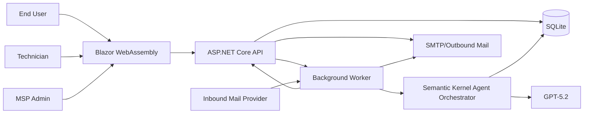

# AI Enabled Helpdesk System - Technical Specification

## 1. Solution Overview

Helpdesk-Light is a multi-tenant helpdesk platform for MSPs built with:

- **Frontend**: Blazor WebAssembly.
- **Backend**: ASP.NET Core Web API.
- **Data Store**: SQLite (single database, row-level tenant partitioning).
- **AI Orchestration**: Semantic Kernel.
- **Model**: GPT-5.2 for triage, response generation, and knowledge article drafting.
- **Channels**: Web and email for ticket creation and communication.

## 2. High-Level Architecture



## 3. Project Structure

```text
Helpdesk-Light/
  src/
    Helpdesk.Light.Web/                # Blazor WASM client
    Helpdesk.Light.Api/                # ASP.NET Core API host
    Helpdesk.Light.Application/        # Use cases, DTOs, validation
    Helpdesk.Light.Domain/             # Entities, enums, domain rules
    Helpdesk.Light.Infrastructure/     # EF Core, email adapters, SK integration
    Helpdesk.Light.Worker/             # Background services (email + AI jobs)
  tests/
    Helpdesk.Light.UnitTests/
    Helpdesk.Light.IntegrationTests/
```

## 4. Core Components

## 4.1 Blazor WebAssembly Frontend

- Route areas:
  - `/login`
  - `/dashboard`
  - `/tickets`
  - `/tickets/{id}`
  - `/knowledge`
  - `/admin/customers`
  - `/admin/domains`
  - `/admin/ai`
- Uses typed API client and JWT auth.
- Real-time updates via polling (MVP) with optional SignalR in phase 2.
- Visual system:
  - CSS custom properties for brand palette.
  - Reusable components for ticket timeline, status chips, and KPI cards.
  - Responsive breakpoints for mobile and desktop.

## 4.2 ASP.NET Core API

- REST API with versioning (`/api/v1`).
- Authentication and authorization with ASP.NET Core Identity + JWT bearer.
- Customer boundary enforcement through middleware + repository filters.
- Validation with FluentValidation (or equivalent).
- Background job dispatch to worker using table-backed queue (SQLite for simplicity).

## 4.3 Worker Services

- **Email Ingestion Worker**
  - Poll IMAP/Graph mailbox.
  - Parse sender, subject, body, references, attachments.
  - Resolve customer by sender domain.
  - Create or append ticket.
- **AI Agent Worker**
  - Processes queued `TicketCreated` and `TicketUpdated` events.
  - Runs Semantic Kernel pipeline and writes outputs.
- **Notification Worker**
  - Sends email notifications and AI drafted responses based on policy.

## 5. Data Model (SQLite + EF Core)

## 5.1 Tables

- `Customers`
  - `Id` (TEXT GUID, PK)
  - `Name` (TEXT, required)
  - `IsActive` (INTEGER bool)
  - `CreatedUtc` (TEXT)
- `CustomerDomains`
  - `Id` (TEXT GUID, PK)
  - `CustomerId` (FK Customers)
  - `Domain` (TEXT, unique)
  - `IsPrimary` (INTEGER bool)
- `Users`
  - `Id` (TEXT GUID, PK)
  - `CustomerId` (nullable FK for MSP staff)
  - `Email` (TEXT, unique)
  - `DisplayName` (TEXT)
  - `Role` (TEXT: EndUser/Technician/MspAdmin)
- `Tickets`
  - `Id` (TEXT GUID, PK)
  - `CustomerId` (FK Customers, indexed)
  - `CreatedByUserId` (FK Users)
  - `Channel` (TEXT: Web/Email)
  - `Status` (TEXT)
  - `Priority` (TEXT)
  - `Category` (TEXT nullable)
  - `Subject` (TEXT)
  - `Summary` (TEXT)
  - `AssignedToUserId` (nullable FK Users)
  - `CreatedUtc`, `UpdatedUtc`, `ResolvedUtc` (TEXT)
- `TicketMessages`
  - `Id` (TEXT GUID, PK)
  - `TicketId` (FK Tickets, indexed)
  - `AuthorType` (TEXT: EndUser/Technician/Agent/System)
  - `AuthorUserId` (nullable FK Users)
  - `Body` (TEXT)
  - `Source` (TEXT: Web/Email/AI)
  - `ExternalMessageId` (TEXT nullable, indexed)
  - `CreatedUtc` (TEXT)
- `KnowledgeArticles`
  - `Id` (TEXT GUID, PK)
  - `CustomerId` (nullable FK for global vs tenant-scoped)
  - `Title` (TEXT)
  - `ContentMarkdown` (TEXT)
  - `Status` (TEXT)
  - `SourceTicketId` (nullable FK Tickets)
  - `CreatedBy` (TEXT: Agent/User)
  - `CreatedUtc`, `UpdatedUtc` (TEXT)
- `AiRuns`
  - `Id` (TEXT GUID, PK)
  - `TicketId` (FK Tickets, indexed)
  - `Model` (TEXT)
  - `Mode` (TEXT: SuggestOnly/AutoRespondLowRisk)
  - `PromptHash` (TEXT)
  - `InputTokens` (INTEGER)
  - `OutputTokens` (INTEGER)
  - `Confidence` (REAL)
  - `Outcome` (TEXT)
  - `CreatedUtc` (TEXT)
- `AuditEvents`
  - `Id` (TEXT GUID, PK)
  - `CustomerId` (nullable FK Customers)
  - `ActorUserId` (nullable FK Users)
  - `EventType` (TEXT)
  - `PayloadJson` (TEXT)
  - `CreatedUtc` (TEXT)

## 5.2 Indexing

- `IX_Tickets_CustomerId_Status_Priority_UpdatedUtc`
- `IX_TicketMessages_TicketId_CreatedUtc`
- `IX_CustomerDomains_Domain` (unique)
- `IX_AiRuns_TicketId_CreatedUtc`

## 6. Multi-Tenant Strategy

- Single SQLite database, row-level tenant partition by `CustomerId`.
- Request context resolves effective customer from:
  1. Authenticated user membership.
  2. Domain resolution for inbound email.
  3. Manual assignment for unmapped items.
- All repository queries enforce customer filter unless requester role is `MspAdmin`.
- Cross-tenant reads/writes blocked by policy handlers and tested with integration tests.

## 7. Semantic Kernel and Agent Design

## 7.1 Kernel Setup

- Register GPT-5.2 chat completion service in Semantic Kernel.
- Configure retry, timeout, and circuit breaker policies.
- Use prompt templates versioned in source control.

## 7.2 Plugins

- `TicketPlugin`
  - Read ticket context, timeline, attachments metadata.
  - Update triage fields and draft responses.
- `KnowledgePlugin`
  - Retrieve top relevant published articles by tenant.
  - Create draft article from resolved ticket summary.
- `CustomerPolicyPlugin`
  - Fetch customer-specific tone, SLA, and auto-response policy.
- `NotificationPlugin`
  - Queue outbound communications through backend service layer.

## 7.3 Agent Pipeline

1. Trigger on `TicketCreated` or qualifying `TicketUpdated`.
2. Gather context:
   - Ticket details and latest messages.
   - Customer profile and policy.
   - Related knowledge articles (retrieval step).
3. Generate:
   - Category + urgency.
   - Suggested resolution actions.
   - Draft response for end user.
4. Score confidence and risk category.
5. Apply mode:
   - `SuggestOnly`: persist drafts for technician review.
   - `AutoRespondLowRisk`: send response if confidence/risk thresholds pass.
6. Persist `AiRun` + timeline events + optional knowledge draft.

## 7.4 Guardrails

- Prompt includes instruction to avoid legal/security commitments and escalate uncertain cases.
- Redact secrets and credentials from model input where detected.
- Block automatic outbound responses for high-risk categories (security incidents, billing disputes, legal requests).
- Human override always available.

## 8. API Contract (Representative Endpoints)

- `POST /api/v1/auth/login`
- `GET /api/v1/tickets?status=&priority=&customerId=`
- `POST /api/v1/tickets`
- `GET /api/v1/tickets/{ticketId}`
- `POST /api/v1/tickets/{ticketId}/messages`
- `POST /api/v1/tickets/{ticketId}/assign`
- `POST /api/v1/tickets/{ticketId}/status`
- `POST /api/v1/tickets/{ticketId}/ai/run`
- `POST /api/v1/tickets/{ticketId}/ai/approve-response`
- `GET /api/v1/knowledge`
- `POST /api/v1/knowledge`
- `PATCH /api/v1/knowledge/{id}`
- `POST /api/v1/admin/customers`
- `POST /api/v1/admin/customers/{id}/domains`

## 9. Email Integration Specification

## 9.1 Inbound

- Monitor support mailbox (`support@helpdesk-light.local` for dev).
- Determine thread behavior:
  - Existing ticket: match by custom header or ticket marker in subject (`[HD-1234]`).
  - New ticket: create ticket with channel `Email`.
- Parse MIME alternatives and sanitize HTML to safe markdown/plaintext.
- Store attachments using local file storage with metadata in DB.

## 9.2 Outbound

- Send notifications on ticket creation, technician comments, status transitions, and resolution.
- Include stable ticket reference token in subject and headers.
- Append unsubscribe/preferences link for notification controls (future phase).

## 10. Security and Compliance

- Password hashing and account lockout via ASP.NET Core Identity defaults.
- JWT token expiry with refresh token flow (optional MVP simplification: short session + re-login).
- HTTPS required in non-dev environments.
- Per-tenant authorization checks on every endpoint.
- Audit trail for admin actions, AI actions, and status changes.
- Data retention policies configurable per customer.

## 11. Observability

- Structured logs with correlation ID per request and ticket event.
- Metrics:
  - API latency.
  - Worker queue depth.
  - AI run duration and token usage.
  - Email processing success/failure.
- Health checks:
  - Database.
  - Mail provider connectivity.
  - AI provider reachability.

## 12. UI and Experience Specification

- Blazor component set:
  - Ticket queue grid with filter chips and saved views.
  - Conversation timeline with author identity and channel badges.
  - AI suggestion panel with "Apply", "Edit", "Send", and "Discard".
  - Knowledge editor with markdown preview.
- Design requirements:
  - Consistent spacing scale and type ramp.
  - State colors for priority and status with accessible contrast.
  - Skeleton loaders and empty states.
  - Mobile-friendly ticket composer and reply actions.

## 13. Deployment

- Environment profile:
  - `Development`: SQLite local file, local mailbox/test harness, GPT-5.2 dev key.
  - `Production`: SQLite on persistent volume, secure secret store, monitored mailbox.
- Deliverables:
  - API and worker container images.
  - Blazor static assets hosted by ASP.NET Core.
- Backup:
  - Scheduled SQLite file backup.
  - Attachment directory backup.

## 14. Testing Strategy

- Unit tests:
  - Domain rules, status transitions, tenant guards.
- Integration tests:
  - API authorization and tenant boundaries.
  - Email ingestion to ticket creation/update.
  - AI worker persistence and policy gating.
- UI tests:
  - Playwright regression suite for login, create ticket, reply, resolve, publish article.
- Performance checks:
  - Queue and ticket list performance at 10k+ records.

## 15. Implementation Phases

1. Foundation:
   - Solution skeleton, auth, customer/domain management, base ticket CRUD.
2. Channel Support:
   - Web ticket flow and email ingestion/outbound.
3. AI Enablement:
   - Semantic Kernel integration, triage and response drafting.
4. Knowledge and Polish:
   - Article generation workflow and UI visual refinement.
5. Hardening:
   - Observability, test coverage expansion, backup/restore runbooks.

