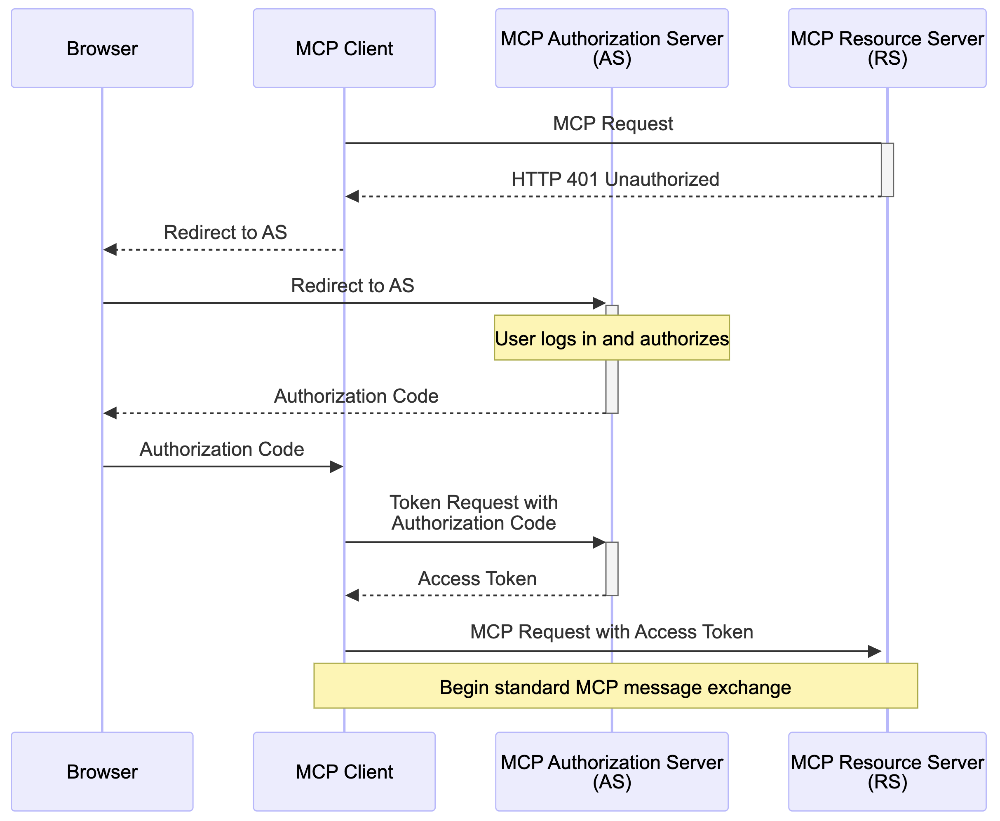
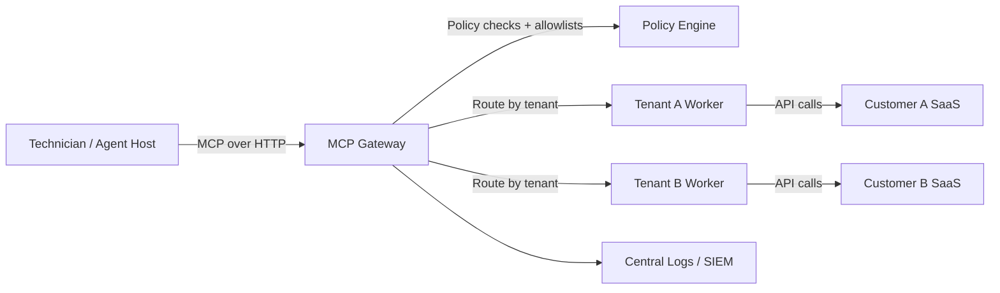

# Curated Model Context Protocol ecosystem for MSP managed services

## Executive summary

The **Model Context Protocol (MCP)** is rapidly becoming the “default plumbing” for letting LLM-based assistants and agents safely interact with real systems, by standardising **tool discovery and invocation** between an *MCP client* (inside a host like an IDE or chat product) and one or more *MCP servers* that expose tools, resources, and prompts. 

For an MSP, MCP is appealing because it reduces the “N models × M tools” integration mess into a repeatable pattern: you build or adopt MCP servers once, then plug them into whichever MCP-capable client your technicians or customers use (IDE assistants, agent frameworks, helpdesk copilots). 

However, **MCP expands your attack surface** in a very MSP-shaped way: it introduces new pathways for **prompt injection, tool poisoning, supply-chain compromise, token leakage, and cross-tenant data bleed** if you centralise it badly. The protocol has explicit security guidance and an OAuth-based authorisation framework for remote servers, but many community servers are still “thin API wrappers with environment variables”, which is not enough for managed services. 

Pragmatically, MSPs should treat MCP as an **integration layer that must be governed** like any other privileged automation surface:
- Prefer **vendor-maintained** MCP servers where they exist (identity, paging, dev platforms, observability), and scrutinise their auth model and audit trail.   
- For MSP core systems (PSA/RMM/documentation), assume you will need **per-tenant isolation**, **just-in-time credentials**, and a **policy enforcement gate** (proxy or gateway) rather than letting every technician’s laptop run “god mode” MCP servers.   
- Build your pilot around a small set of **read-mostly** use cases first (triage, reporting, investigations), then graduate to write actions with strict controls. 

## Definitions and scope

### What MCP is

**MCP is an open protocol** for connecting LLM applications to external tools and data sources via a standard client-server interaction model. The official specification is versioned (for example **2025-11-25**), and the schema is defined in TypeScript with an auto-generated JSON Schema. 

In MCP terms:
- An **MCP server** is a program (local or remote) that exposes capabilities through the protocol.   
- An **MCP client** lives inside a host (IDE, chat app, agent runtime) and connects to one or more servers to list tools and call them. 

MCP servers can expose three main capability types:
- **Resources** (file-like data a client can read),
- **Tools** (callable functions),
- **Prompts** (templates/workflows surfaced in clients). 

### Transports and authorisation scope boundary

MCP commonly appears in two operational modes:

- **Local (STDIO) servers**: launched as a local process and spoken to over standard input/output. For these, the spec guidance is that they **should not use** the HTTP authorisation specification; they typically use environment-based credentials instead.   

- **Remote (HTTP-based) servers**: accessed over “streamable HTTP” or SSE-style transports (capabilities vary by client). These should use the MCP authorisation framework, which is based on **OAuth 2.1** and requires **OAuth 2.0 Protected Resource Metadata (RFC 9728)** for authorisation server discovery.   

This distinction matters for MSPs because STDIO servers are often implicitly trusted “local admin tools”, whereas remote servers need to be operated like any internet-exposed API: authentication, authorisation, rate limiting, monitoring, and patching.

### What this report means by “MCPs”

The user request uses “MCPs” in plural. In the ecosystem, the dominant meaning is **one protocol** (MCP), with many **MCP servers** (implementations/connectors) and supporting infrastructure (registries, gateways, bridges). This report therefore curates:
- The MCP **specification and supporting infrastructure** (registries, SDKs, bridging tools),
- A **curated list of MCP servers** relevant to MSP operations (vendor-maintained where possible, then higher-signal community options),
- **Integration patterns** for multi-tenant MSP environments.





## What MSPs should evaluate

This section turns your requested attributes into an MSP-focused checklist. Where the attribute is not natively provided by MCP itself, the key point is **where it must be implemented** (server, gateway, client policy, or platform controls).

### Compatibility with major LLMs and clients

MCP is designed to be model-agnostic, but “compatibility” in practice means **which hosts/clients your technicians and customers actually use**.

High-signal client ecosystems with documented MCP support include:
- **VS Code** (as an MCP client for tool use)   
- **GitHub Copilot agent mode** using MCP servers   
- **Microsoft Copilot Studio** connecting to MCP servers (resources/tools/prompts)   
- **OpenAI Codex** (CLI + IDE extension) supporting STDIO and streamable HTTP, including OAuth   
- **OpenAI API** via the Responses API “MCP tools” concept for remote servers/connectors   

**Unspecified**: a single authoritative, ecosystem-wide list of “major LLMs that natively support MCP” that is stable over time. The practical answer is to standardise your server surface around MCP, and choose clients per workflow (helpdesk vs engineering vs SOC) with documented MCP support.

### Security and privacy controls

MCP’s security posture is only as good as:
1) the **server implementation**, and  
2) the **operational controls** you wrap around it.

Key check items:
- **Auth model**: STDIO (env secrets) vs remote OAuth-based auth.   
- **OAuth discovery correctness** (RFC 9728 Protected Resource Metadata) for remote servers.   
- **Prompt injection and tool poisoning controls**, including input validation and tool scoping.   

Concrete warning: even “official” MCP servers can have serious flaws; there have been public reports of vulnerabilities in an official Git-related MCP server that could be chained into RCE/file tampering in certain configurations. 

### Multi-tenant support

MCP doesn’t inherently define tenancy; multi-tenancy is an MSP deployment choice.

Minimum viable multi-tenant patterns:
- **One MCP server instance per customer tenant**, with tenant-scoped credentials and firewall rules.
- **One “gateway” that enforces tenant routing + policy**, but still isolates execution (containers/VMs) per tenant.
- **Hard ban** on “shared credentials across tenants”, even if the MCP tools are read-only.

The protocol security guidance explicitly discusses risks like session hijacking and states that authorisation is strongly recommended for sensitive/user-specific data. 

### Auditability and logging

You want:
- **Tool call logs** (who invoked what, when, parameters, outputs or output hashes),
- **Authorisation traces** (subject identity, scopes, token audience),
- **Change logs** (write actions: ticket edits, device actions, config changes).

Some MCP documentation and vendor guides highlight logging locations and troubleshooting flows (example: client logs for server connections).   
Most community servers treat logging as “print to stderr”; for MSP-grade ops, assume you will add structured logs at your gateway layer.

### Policy enforcement

Policy enforcement is rarely “built into” an MCP server. It is usually best implemented in one of:
- A **trusted MCP gateway** (proxy) that validates requests, redacts data, enforces allowlists, rate limits, and blocks dangerous tools/actions.
- The **host client’s admin policies** (for example, organisational restrictions on which MCP servers can be used).   

### Scalability and latency

Latency drivers tend to be:
- OAuth flow and token exchange (remote servers),
- Backend SaaS API rate limits,
- Serial tool invocation loops by agents.

For scale you typically need:
- Stateless or horizontally scalable server runtimes where possible,
- Central rate-control and caching at the gateway,
- Tool design that avoids “chatty” APIs.

Some providers explicitly support modern remote transports and managed infrastructures (for example, n8n supports SSE and streamable HTTP for MCP server mode). 

### Deployment models

Expect three deployment models in MSP land:
- **On-prem** (customer site or MSP DC): good for regulated/offline, but treat as “most expensive to operate”.
- **Cloud** (your cloud or vendor cloud): easiest to scale, but customer data sovereignty becomes harder.
- **Hybrid**: most common for MSPs, where the gateway is central but connectors execute close to data.

### Integration APIs

Assess:
- API breadth: does the MCP server expose only a few curated operations, or “everything”?
- Tool semantics: are tools task-level (good) or raw REST endpoints (risky, noisy)?
- Error handling, retries, pagination.

MCP supports structured tool descriptions (often JSON Schema-based), and hosts like VS Code rely on that contract for tool discovery and invocation. 

### Cost considerations

Costs are rarely the MCP server software itself. The real costs are:
- Engineering + security review (if self-hosted or community),
- Operations (monitoring, patching, incident response),
- API usage fees (SaaS platforms),
- LLM usage (more tools can increase agent loops),
- Compliance overhead.

Managed MCP platforms advertise reduced auth/credential handling burden, but you trade for vendor dependence and potential data exposure concerns (you must read their security docs). 

### Compliance certifications

MCP servers themselves typically do not come with “SOC 2 certified” stamps; your compliance posture comes from:
- The **platform** hosting the MCP server/gateway,
- Your operational controls,
- The underlying SaaS vendor compliance for the systems accessed.

SOC 2 is defined around controls for security/availability/etc, not “a protocol badge”. 

### Update and maintenance processes

For MSPs, “maturity” should be judged more by:
- Vendor ownership and patch cadence,
- Availability of security advisories,
- Version pinning and changelogs,
- Registry trust signals.

The official MCP registry is in preview and explicitly warns about breaking changes/data resets pre-GA.   
If you adopt community servers, assume you will need to fork and own them if they become mission critical.

## Curated MCPs relevant to MSP managed services

Below is a curated set of MCP servers and MCP infrastructure that are the most relevant to MSP operations. Each entry includes: summary, key features, MSP pros/cons, typical use cases, and maturity. Where details were not stated in official sources, they are marked **unspecified**.

### MCP Speficiation and SDK Ecosystem

**Summary**: The core MCP spec and official docs define the protocol and core concepts (servers expose resources/tools/prompts; clients discover and invoke). The spec is versioned (example: 2025-11-25) with a canonical TypeScript schema and derived JSON Schema, and security guidance includes OAuth-based authorisation for remote servers. 

Key features: versioned specification; SDKs in multiple languages (details in official docs); security best practices; authorisation model for HTTP transports.   
Pros for MSPs: neutral integration contract; reduces vendor lock-in; enables multi-client support.   
Cons: not a turnkey governance solution; community servers vary wildly in quality.   
Typical use cases: standardising tool access across PSA/RMM/SOC tooling; building internal agents.   
Maturity/stability: high for the protocol itself; evolving (versioned) with security and transport changes over time. 

### The Linux Foundation governance track

**Summary**: The MCP project is described as an open source project hosted by the Linux Foundation, with industry-wide adoption and governance efforts (also discussed publicly by major ecosystem actors). 

Pros for MSPs: increased standard stability and multi-vendor participation over time.   
Cons: governance maturity does not automatically fix server-level security problems.   
Maturity: improving; specifics of governance and roadmaps are **unspecified** in this report beyond cited announcements.

### [MCP Registry (official, preview)](https://modelcontextprotocol.io)

**Summary**: The official MCP Registry is a central metadata repository for publicly accessible MCP servers, includes DNS-based namespace management, and provides a REST API and OpenAPI spec for discovery. It is explicitly “in preview” and may experience breaking changes/resets pre-GA. 

Key features: standard server metadata format; namespace verification; separation between “metadata registry” and package registries; encourages private registries for private servers.   
Pros for MSPs: improves discoverability and provenance checks for public servers; useful for building internal curation workflows.   
Cons: not designed for self-hosting (officially); private server publishing is out of scope.   
Maturity: preview.

### Docker MCP Registry and catalog ecosystem

**Summary**: Docker runs an “Official Docker MCP Registry” as a curated catalog of MCP servers aligned with Docker tooling, with documentation describing contribution and availability via Docker Desktop tooling and catalog. 

Key features: packaging MCP servers as deployable images; catalog distribution; contribution processes that include tool listing validation.   
Pros for MSPs: repeatable packaging and deployment; useful supply-chain baseline for containerised MCP servers.  
Cons: catalog inclusion criteria and depth of security scanning are **unspecified** beyond Docker’s statements; still requires your own security review.   
Maturity: active, with ongoing updates.

### OpenAI MCP support surface (Codex, ChatGPT, API)

**Summary**: OpenAI documents MCP support across multiple surfaces:
- Codex supports STDIO and streamable HTTP MCP servers, including OAuth (with CLI login flow).   
- The Responses API includes an “MCP tools” capability to connect models to remote MCP servers or connectors.   
- ChatGPT has “apps/connectors” and developer mode content that references MCP-based apps/connectors (beta/plan-dependent).   

Key features: remote MCP tool configuration; OAuth token handoff; connector concept (OpenAI-maintained MCP wrappers).   
Pros for MSPs: viable for building your own “agentic managed service” workflows; supports OAuth-based remote servers.   
Cons: feature maturity varies by product surface and plan; exact limits for multi-tenant governance in ChatGPT are **unspecified** in this report.   
Maturity: mixed; API support is documented; some ChatGPT features explicitly marked beta. 

### [Microsoft MCP client and server surfaces (Copilot Studio, VS Code, Dataverse)](https://learn.microsoft.com/en-us/microsoft-copilot-studio/agent-extend-action-mcp)

**Summary**: Microsoft has broad MCP integration:
- Copilot Studio can connect to MCP servers and use resources/tools/prompts.   
- VS Code documents MCP server usage as a client, including organisational restrictions.   
- Microsoft also documents “Dataverse can act as an MCP server” (page requires auth for full content; key claim is visible).   

Pros for MSPs: strong fit for M365-heavy MSPs; integrates with customer tenant governance patterns; explicit mention of dynamic discovery and OAuth.   
Cons: feature limitations differ by host; for example GitHub Copilot coding agent documentation notes limitations around remote OAuth MCP servers (at least at the time of that doc).   
Maturity: generally high for Copilot Studio and VS Code, with ongoing evolution.

### [BPA1 MCP Server](https://www.bpa1.com)

**Summary**: There is a vendor supported MCP Server for BPA1

Key features: official server implementation, documented for use with ChatGPT and Claude. OAuth based configuration allows for secure access.
Pros for MSPs: strong for AI-Enabled process automation.
Cons: developer-auriented.
Maturity: beta (official).

### [GitHub MCP server](https://github.com/github/github-mcp-server)

**Summary**: GitHub provides an official MCP server and documentation for using it with Copilot Chat/agent mode to interact with repositories, issues, PRs, and workflows. 

Key features: official server implementation; documented use with Copilot; OAuth-based remote configuration options exist in GitHub docs for some environments.   
Pros for MSPs: strong for DevOps/SRE managed services; good example of a mature MCP server surface.  
Cons: developer-oriented; not a PSA/RMM system; tenant boundary depends on GitHub org controls.  
Maturity: high (official).

### [Okta MCP server](https://developer.okta.com/docs/concepts/mcp-server/)

**Summary**: Okta provides an MCP server integrating with Okta Admin Management APIs, emphasising least privilege via OAuth scopes, scope validation, and auditability, with official docs and a GitHub repo. 

Key features: OAuth-based auth flows; prevention of unauthorised calls by scope validation; designed for IAM administrative automation.   
Pros for MSPs: excellent fit for identity operations; aligns with least-privilege posture; supports repeatable automation patterns.   
Cons: high blast radius if mis-scoped; must isolate tenant credentials per customer.  
Maturity: high (official).

### [PagerDuty MCP server](https://github.com/PagerDuty/pagerduty-mcp-server)

**Summary**: PagerDuty provides an official MCP server (GitHub) and integration guide, allowing AI assistants to interact with incidents, services, schedules, and orchestrations. 

Key features: incident management tools; vendor-maintained server; guidance and lessons learned blog.   
Pros for MSPs: powerful for NOC/SOC workflows (triage, summarise, correlate, escalate).  
Cons: write actions must be gated to avoid accidental paging or incident churn.  
Maturity: high (official).

### [Datadog MCP server](https://docs.datadoghq.com/bits_ai/mcp_server/)

**Summary**: Datadog documents an MCP server that acts as a bridge between Datadog observability data and MCP-capable agents/clients. 

Pros for MSPs: strong for managed observability; accelerates root cause analysis patterns; helps unify “ask the telemetry” workflows.  
Cons: if exposed broadly, telemetry can contain sensitive identifiers; enforce redaction and data minimisation at the tool layer. (Redaction strategy implementation is **unspecified** by Datadog docs in this report.)  
Maturity: vendor-documented; specific deployment modes beyond their docs are **unspecified** here.

### [Elastic MCP servers](https://www.elastic.co/docs/explore-analyze/ai-features)

**Summary**: Elastic documents MCP server options for connecting agents to Elasticsearch data, including an Agent Builder–aligned server for newer deployments and a separate `mcp-elasticsearch` option for older versions. 

Pros for MSPs: fits managed SIEM/log analytics; enables investigate-with-agent workflows.  
Cons: tool design must prevent overly-broad search/exfiltration patterns; enforce query constraints and audit.  
Maturity: vendor-documented.

### [Amazon Web Services official MCP servers and deployment guidance](https://github.com/awslabs/mcp)

**Summary**: AWS maintains official MCP server resources and documentation, framing MCP servers as lightweight programs with 1:1 client connections and listing common MCP clients. AWS also provides guidance for deploying remote MCP servers on AWS with secure authentication, referencing a specific MCP spec version and OAuth-related standards. 

Pros for MSPs: strong for cloud managed services; aligns well with “agent as operator” patterns; AWS-authenticated remote deployments are a natural fit.  
Cons: cost and complexity if you generalise too early; start with a few high-value tools.  
Maturity: high.

### [Cloudflare MCP servers and portals](https://developers.cloudflare.com/agents/model-context-protocol/mcp-servers-for-cloudflare/)

**Summary**: Cloudflare documents MCP support and provides MCP server implementations for Cloudflare services, plus concepts like MCP server portals (centralising multiple MCP servers behind one endpoint). 

Key features: managed remote MCP server catalog; OAuth connection patterns; portal concept for consolidation.   
Pros for MSPs: useful for MSP-operated edge/security services; portal concept maps to MSP “one ingress, many tools”.   
Cons: consolidation increases blast radius; portals must enforce strict per-tenant routing and auth.  
Maturity: high (vendor).

### [Atlassian remote MCP server ecosystem](https://community.atlassian.com/forums/Atlassian-Remote-MCP-Server/Using-the-Atlassian-Remote-MCP-Server-beta/ba-p/3005104)

**Summary**: Atlassian has a remote MCP server beta and related ecosystem discussions, including OAuth support and governance features such as audit logs and allowlists (as described in third-party coverage and Atlassian community material). 

Pros for MSPs: strong for customers using Jira/Confluence; useful for ticketing and knowledge operations.  
Cons: public sources in this report include community/news coverage; official “new comprehensive documentation” is referenced but not fully captured here, so some detail is **unspecified**.   
Maturity: beta (per Atlassian community note). 

### [ServiceNow MCP server pattern](https://www.servicenow.com/community/developer-articles/how-to-create-your-own-servicenow-mcp-server/ta-p/3298144)

**Summary**: ServiceNow published a developer article describing how to create a ServiceNow MCP server wrapper around ServiceNow REST APIs and consume it via a desktop MCP client. 

Pros for MSPs: direct relevance if you manage ServiceNow for customers; good starting blueprint.  
Cons: this is a “how to build your own” guide, not a vendor-supported official MCP server; maturity and security posture depend on your implementation.  
Maturity: pattern/guide; production readiness is **unspecified**.

### [HaloPSA MCP endpoint capability](https://usehalo.com/it/haloitsm/guides/2597/)

**Summary**: Halo documents an MCP HTTP endpoint allowing AI assistants to connect and dynamically invoke Halo API tools, including examples like knowledge search and ticket actions (feature referenced in product updates and guides). 

Pros for MSPs: unusually direct PSA fit; potential to expose a controlled PSA tool surface without third-party wrappers.  
Cons: you still must enforce tenant boundaries and scope; exact auth and audit capabilities beyond “allows AI assistants such as OpenAI to connect” are **unspecified** here without deeper internal Halo docs capture.   
Maturity: shipping feature (available as of a named Halo version). 

### [ConnectWise Manage/PSA community MCP servers](https://github.com/jasondsmith72/CWM-API-Gateway-MCP?utm_source=chatgpt.com)

**Summary**: There are community MCP servers for ConnectWise Manage/PSA, including an “API Gateway MCP Server” aimed at simplifying discovery/execution across the ConnectWise Manage API. 

Pros for MSPs: directly useful for ticketing, company/contact management, linking automation to PSA.  
Cons: community-maintained; security posture varies; design can devolve into “raw API passthrough”. Treat it as code that must be reviewed, sandboxed, and tenant-isolated.  
Maturity: community; production readiness is **unspecified** and must be validated in your pilot.

### [Kaseya Autotask PSA community MCP server](https://github.com/asachs01/autotask-mcp?utm_source=chatgpt.com)

**Summary**: A community MCP server exists for Autotask PSA, exposing structured access to Autotask data and operations; it is distributed via GitHub and npm. 

Pros for MSPs: PSA-centric; good for reporting, triage, contract/ticket analysis.  
Cons: community; you must do your own security review, and you should strongly prefer per-tenant execution with per-tenant credentials.  
Maturity: community.

### [NinjaOne community MCP servers](https://github.com/wyre-technology/ninjaone-mcp)

**Summary**: Community MCP server implementations exist for NinjaOne, including a decision-tree-based MCP server repo. 

Pros for MSPs: direct RMM operations surface; can accelerate endpoint investigations (inventory, alerts) and controlled remediation.  
Cons: community code; RMM write actions are high risk; enforce strict approval gates, rate limits, and audit.  
Maturity: community; vendor-supported status is **unspecified** in the sources captured here.

### [Datto Datto RMM community MCP server](https://github.com/josh-fisher/datto-rmm)

**Summary**: A community “Datto RMM Tooling” repo explicitly includes an MCP server for AI assistant integration plus type-safe API clients, with OAuth 2.0 token handling. 

Pros for MSPs: direct RMM fit; includes engineering-friendly API client tooling; OAuth support reduces static-secret exposure.  
Cons: community; still requires strong tenant separation and guardrails for remote execution.  
Maturity: community.

### [Pipedream managed MCP servers](https://pipedream.com/docs/connect/mcp)

**Summary**: Pipedream runs hosted MCP servers for thousands of APIs and states that credentials are encrypted at rest and requests are made via Pipedream’s servers, not directly exposing credentials to AI models. It supports remote transports and offers fully-managed OAuth for many integrations. 

Pros for MSPs: fast time-to-value; broad SaaS coverage; less custom connector work; useful for “small MSP” or “pilot fast” profiles.  
Cons: introduces an intermediary handling requests and credentials; suitability for regulated customers depends on contractual/security review (some detail is **unspecified** without your vendor due diligence).   
Maturity: high as a platform.

### [Zapier managed MCP (beta)](https://help.zapier.com/hc/en-us/articles/36265392843917-Use-Zapier-MCP-with-your-client?utm_source=chatgpt.com)

**Summary**: Zapier provides an MCP endpoint to connect your Zapier account to MCP-capable clients, and documents setup for popular clients. Help docs label MCP features as beta in at least some contexts. 

Pros for MSPs: similar to Pipedream; huge integration library; simple proof-of-value.  
Cons: beta maturity flags; complex multi-tenant governance depends on Zapier account/workspace design (details **unspecified** in this report).   
Maturity: mixed; MCP integration appears beta in some docs.

### [n8n MCP server mode and MCP client mode](https://docs.n8n.io/integrations/builtin/core-nodes/n8n-nodes-langchain.mcptrigger/)

**Summary**: n8n can act as an MCP server via “MCP Server Trigger”, exposing a URL that MCP clients can use to list and call tools. It supports SSE and streamable HTTP and provides authentication options (bearer/header). It also provides an MCP client tool node for consuming external MCP tools. 

Pros for MSPs: strong for orchestrating “agent calls workflow” patterns; can wrap legacy systems; supports both server and client roles.  
Cons: requires careful deployment: the docs warn about SSE/streamable HTTP needing connection affinity (single replica or dedicated routing).   
Maturity: high as a workflow platform; MCP features are documented.

### [Kubernetes MCP server](https://github.com/containers/kubernetes-mcp-server)

**Summary**: There is a Kubernetes MCP server implementation with support for Kubernetes and OpenShift. 

Pros for MSPs: useful for managed Kubernetes; enables natural language cluster introspection and controlled operations.  
Cons: extremely high blast radius; must enforce read-only defaults, change windows, and strict approval for write actions (scale, delete, patch).  
Maturity: community (project-owned by a Kubernetes-focused org; vendor support **unspecified**).

### [Splunk community MCP server](https://github.com/livehybrid/splunk-mcp)

**Summary**: A community Splunk MCP tool exists for interacting with Splunk Enterprise/Cloud, offering searching and resource access capabilities. 

Pros for MSPs: SOC investigations and reporting; aids “ask the SIEM” operations.  
Cons: community; must harden queries, restrict index scope, prevent exporting sensitive data.  
Maturity: community.

## Implementation notes for MSP environments

This section focuses on how to deploy MCP safely in **on-prem, cloud, and hybrid MSP** realities, including tenancy isolation, secrets, monitoring, IR, and change management.

### Integration patterns that actually work for MSPs

#### Pattern: Technician-local MCP (fast pilot, low governance)

Use STDIO MCP servers run on a technician workstation (or ephemeral VM) with tenant-scoped credentials injected via environment variables. MCP docs describe STDIO servers relying on environment-based credentials, and client-side logging paths exist for troubleshooting in desktop hosts. 

Why it works: quickest way to validate value, minimal infrastructure.  
Why it fails at scale: credential sprawl, inconsistent controls, hard-to-audit actions.

#### Pattern: Central MCP gateway with per-tenant execution workers (recommended baseline)

You run a controlled remote MCP entrypoint that authenticates users (OAuth), enforces policy, then routes tool calls to tenant-isolated workers (containers/VMs) that hold only that tenant’s secrets.

This aligns with the MCP authorisation model (OAuth 2.1, RFC 9728 discovery) for remote servers. 



Hard rules:
- Gateway must be the *only* exposed endpoint.
- Workers must have **no cross-tenant network path**.
- Secrets must never be stored on the gateway longer than necessary (details below).

#### Pattern: Managed MCP platforms (Pipedream/Zapier) for breadth, with MSP-side policy overlay

If you use managed MCP platforms, treat them like a “tool fabric” and still wrap with:
- client allowlists,
- tool allowlists,
- data redaction layer,
- tenant tagging and audit.

Pipedream explicitly positions itself as providing managed OAuth and credential storage for thousands of APIs.   
Zapier’s MCP help docs exist and label some features beta. 

### Tenancy isolation strategies

Use one of:

**Tenant-isolated execution (strongly recommended)**  
- One worker per tenant (container/VM).  
- Worker has only tenant credentials and network routes.  
- Rotate credentials per tenant, not per server.  

**Tenant-isolated credentials + strict tool scoping (minimum acceptable)**  
- Single shared server instance, but credentials are selected per request by tenant and never cached.
- Very hard to do safely if tool calls can include arbitrary parameters.  
- Suitable only for low-risk read-only tools.

**Unacceptable**  
- Shared admin tokens across tenants.
- Shared “global PSA/RMM admin” token to service multiple client environments, unless it is an MSP multi-tenant platform with strong internal tenancy controls (and you still audit).

### Secrets management

For STDIO servers, secrets are commonly injected via environment variables.   
For remote servers, use OAuth where possible and avoid long-lived static secrets.

Practical MSP tactic:
- Use OAuth with proper scopes whenever the vendor supports it (Okta explicitly designs around scoped OAuth).   
- Store refresh tokens in a vault (HSM-backed where possible), and mint short-lived access tokens on demand.
- Bind tokens to resource/audience if supported by your IdP, consistent with MCP security expectations (some IdP limitations exist, see Keycloak’s guidance).   

### Monitoring and incident response

Minimum telemetry you should capture:
- MCP connection lifecycle events (connect/disconnect/errors),
- tool invocation audit logs (tool name, tenant, user, parameters, outcome),
- downstream API errors and rate-limit responses.

The MCP build-server guide describes how some desktop hosts write MCP logs, which is useful locally but not a substitute for central logging in MSP operations. 

Incident response playbook triggers:
- Unusual tool call volume or new tools used by a user,
- Attempts to access disallowed tenants,
- Prompt injection indicators (tool call parameters attempting to exfiltrate secrets),
- OAuth consent anomalies.

Real-world warning signals exist in adjacent agent ecosystems, such as reports of OAuth token theft abuse patterns in agent tooling that rely on user consent flows. 

### Change management

Treat MCP servers like production integrations:
- Pin versions, use SBOMs where possible, and deploy via CI/CD.
- Run contract tests against “tools/list” and critical tools (Docker’s registry contribution process mentions validating list-tools behaviour).   
- Controlled rollout per tenant, with change windows for write actions.

## Evaluation matrix and recommendations

### Comparison matrix across MSP-critical attributes

Legend:
- **Auth**: STDIO-env, API key, OAuth (remote).
- **Tenancy**: per-tenant possible (Yes/Depends), native multi-tenant (Native), or weak (Risky).
- **Audit**: built-in meaningful audit trail (Strong), basic logs (Basic), must add (Add).
- **Policy**: native policy controls (Some), rely on gateway (Gateway), or minimal (Minimal).
- **Maturity**: Official/Vendor, Community, Preview/Beta.

| MCP server / platform | Auth options | Tenancy support | Audit/logging | Policy enforcement | Deployment models | Cost profile | Compliance stance | Maturity |
|---|---|---|---|---|---|---|---|---|
| MCP spec + SDKs | N/A | N/A | N/A | N/A | N/A | Free | N/A | High  |
| MCP Registry | N/A | N/A | N/A | Some provenance | SaaS registry | Free | N/A | Preview  |
| Docker MCP Registry/catalog | N/A | N/A | N/A | Some curation | Container-centric | Free tooling, infra cost | N/A | Active  |
| OpenAI (Codex/API MCP tools) | STDIO, streamable HTTP, OAuth | Depends (you design) | Add (your infra) | Gateway recommended | Local + remote | Usage-based | Inherited + your controls | Documented  |
| Microsoft (Copilot Studio/VS Code) | OAuth, keys (varies) | Depends | Add + platform logs | Org policy possible | SaaS + desktop | Licence-based | Inherited + your controls | High  |
| GitHub MCP Server | OAuth/PAT (varies by client) | Depends (org separation) | Strong platform logs | Some (scopes) | Local + remote | SaaS + infra | Inherited + your controls | Official  |
| Okta MCP Server | OAuth 2.0 scopes | Per-tenant strongly recommended | Strong intent | Some | Remote/server | SaaS + infra | Inherited + your controls | Official  |
| PagerDuty MCP Server | Token/OAuth (varies) | Depends | Strong | Gateway recommended | Local + remote | SaaS + infra | Inherited + your controls | Official  |
| Datadog MCP Server | Unspecified in docs snippet | Depends | Add/depends | Gateway recommended | Remote/server | SaaS + infra | Inherited + your controls | Vendor-documented  |
| Elastic MCP servers | Unspecified | Depends | Add/depends | Gateway recommended | Remote/server | SaaS/self-managed | Inherited + your controls | Vendor-documented  |
| AWS MCP servers + guidance | OAuth patterns available | Depends | Add/depends | Some via AWS controls | Cloud-native | Usage-based | Inherited + your controls | Official  |
| Cloudflare MCP servers/portals | OAuth supported | Depends | Add/depends | Portal allowlisting possible | Remote/server | Usage-based | Inherited + your controls | Vendor  |
| HaloPSA MCP endpoint | Unspecified | Depends | Unspecified | Unspecified | Remote endpoint | SaaS | Inherited + your controls | Shipping feature  |
| ServiceNow MCP (build-your-own) | Your choice | Depends | Your choice | Your choice | Your infra | Your cost | Your compliance | Pattern only  |
| ConnectWise PSA community servers | API key / unspecified | Per-tenant recommended | Basic/Add | Gateway required | Usually STDIO/containers | Low licence, high ops | Your controls | Community  |
| Autotask community server | API key / unspecified | Per-tenant recommended | Basic/Add | Gateway required | STDIO/containers | Low licence, high ops | Your controls | Community  |
| NinjaOne community servers | OAuth (some) / varies | Per-tenant recommended | Basic/Add | Gateway required | STDIO/remote | Low licence, high ops | Your controls | Community  |
| Datto RMM community server | OAuth 2.0 | Per-tenant recommended | Basic/Add | Gateway required | STDIO/remote | Low licence, high ops | Your controls | Community  |
| Pipedream managed MCP | Managed OAuth | Workspace/tenant depends | Platform logs | Some via platform | Remote | SaaS subscription | Vendor posture + your review | Platform зрелость  |
| Zapier MCP | Managed | Workspace/tenant depends | Platform logs | Some | Remote | SaaS subscription | Vendor posture + your review | Beta (docs)  |
| n8n MCP server mode | Bearer/header auth | Depends | Add | Gateway recommended | Remote | Self-hosted or SaaS | Your controls | Documented  |

### Recommended MCPs by MSP profile

**Small MSP (lean ops, needs breadth fast)**  
Start with managed MCP platforms plus 1–2 vendor official servers:
- Pipedream MCP for breadth across SaaS.   
- Zapier MCP as alternative/adjunct (accept beta maturity if you must).   
- Add 1–2 “high ROI” official servers: Okta (identity) and PagerDuty (incidents) if those are in your stack.   

Avoid early: community PSA/RMM write actions. Do read-only reporting first.

**Mid-market MSP (has some engineering, wants differentiated managed services)**  
- Build a **gateway + per-tenant worker** architecture (hybrid).   
- Adopt official/vendor servers where possible: GitHub, Okta, AWS, Cloudflare, PagerDuty, Elastic/Datadog depending on customer stack.   
- For PSA: if you run HaloPSA and the MCP endpoint meets your security needs, it is a strong candidate; otherwise build controlled wrappers.   

**Enterprise MSP (regulated customers, strict governance, SOC2 expectations)**  
- Use only vendor-supported servers or internally built servers with full SDLC, threat modelling, and formal change management.  
- Require OAuth-based remote MCP with RFC 9728 discovery and explicit scope-based authorisation.   
- Build an internal private registry/gateway model (since official registry is for public servers and not for private internal endpoints).   
- Default posture: read-only tools; gated write actions with approvals and strong audit.

### Recommended MCPs by use-case

**Security-sensitive operations (identity, IR, SOC)**  
Best starting set:
- Okta MCP server (least privilege focus).   
- PagerDuty MCP server (incident actions).   
- Elastic MCP server (SIEM/search).   
- Add cloud platform MCP (AWS) where relevant.   

**High-throughput operations (mass ticket triage, monitoring correlation)**  
- Prefer platforms that support remote transports and scale patterns (n8n server mode, cloud-native deployments).   
- Avoid chatty “raw REST passthrough” MCP servers.

**Regulated industries (healthcare, finance, government)**  
- Treat MCP as processing of regulated data; enforce encryption, access controls, audit controls, and breach response alignment consistent with HIPAA Security Rule and GDPR security obligations.   
- Prefer on-prem or customer-controlled hosting for connectors that touch regulated datasets; remote managed MCP platforms require heavy vendor due diligence (details vary and are **unspecified** here).

## Migration, interoperability, risks, and compliance mapping

### Migration and interoperability considerations

**Protocol version drift**  
MCP is versioned; remote auth requirements and transports have evolved. If you deploy servers, pin to a spec version and test clients against it. 

**Transport bridging**  
You will hit cases where a client supports only STDIO, but a server is remote (or vice versa). Tools like `mcp-remote` exist to bridge remote servers to local-only clients with auth support.   
This is useful during migration, but it adds another component to patch and monitor.

**Tool semantics alignment**  
MCP tools often mirror underlying APIs. If you migrate from bespoke integrations to MCP:
- consolidate “micro-tools” into task-level tools to reduce tool-selection noise,
- add server-side validations for parameters,
- treat “tools/list” as part of your contract tests.

### Risks and mitigations

| Risk | Why it matters for MSPs | Mitigation baseline | Sources |
|---|---|---|---|
| Prompt injection (direct + indirect) | Can cause an agent to misuse tools or exfiltrate data | Input validation, tool scoping, allowlists, output filtering, human approval for writes |  |
| Supply-chain compromise (community servers) | MSP tooling often runs with high privileges | Use curated registries, code review, SBOMs, pin versions, sandbox execution |  |
| Token/credential leakage | Cross-tenant leakage is catastrophic in MSP context | Prefer OAuth, short-lived tokens, per-tenant secret isolation, vault-backed storage |  |
| Session hijacking in stateful HTTP servers | Remote MCP introduces session surfaces | Follow MCP security best practices; minimise state; validate sessions |  |
| Over-privileged tools | “AI can do everything” becomes “AI can break everything” | Read-only defaults, explicit approval for write tools, strict scopes |  |
| Vulnerable server implementations | Even official servers can have serious issues | Patch cadence, threat modelling, run in sandbox, least privilege |  |

### Compliance mapping (GDPR, HIPAA, SOC 2)

This is not legal advice; it is a controls mapping lens.

**GDPR**  
- Article 32 requires appropriate technical and organisational security measures (including encryption/pseudonymisation where appropriate).   
- Article 30 requires records of processing activities, including security measures.   
Australian entities may need to consider GDPR applicability; OAIC provides guidance.   

**HIPAA Security Rule**  
- Technical safeguards include audit controls and encryption/addressable requirements; official summaries and regulation text are available.   

**SOC 2**  
- SOC 2 reports cover controls relevant to security, availability, processing integrity, confidentiality, and privacy, based on AICPA Trust Services Criteria.   

Control-to-requirement mapping:

| Control you implement around MCP | GDPR | HIPAA Security Rule | SOC 2 TSC |
|---|---|---|---|
| Per-tenant isolation + least privilege scopes | Art. 32 security of processing  | Access control, integrity safeguards  | Security, confidentiality  |
| Central audit logs for tool calls and auth | Art. 30 records + Art. 32 measures  | Audit controls  | Security, availability  |
| Encryption of secrets and sensitive outputs | Art. 32 encryption  | Encryption/addressable, protect ePHI  | Confidentiality  |
| Change management and patching for MCP servers | Art. 32 “state of the art” measures  | Ongoing safeguards review (policy-driven)  | Change management supports availability/security  |
| Prompt injection controls and DLP | Art. 32 risk-appropriate measures  | Protect confidentiality/integrity  | Security/confidentiality  |

## Prioritised next steps and pilot checklist

### A blunt prioritisation for MSPs

If you do only five things, do these:

1) **Pick one deployment pattern** (gateway + per-tenant workers is the sane default).   
2) **Start read-only**: reporting, triage, investigations. Do not let the first pilot write to PSA/RMM.   
3) **Use OAuth where available** and remove static secrets from technician devices.   
4) **Centralise audit logs** for every tool call. (Protocol guidance stresses audit needs for sensitive actions; HIPAA explicitly requires audit controls in systems handling ePHI.)   
5) **Curate your MCP servers**: vendor-supported first; community only with review, pinning, and sandboxing.   

### Pilot checklist

**Scoping**
- Define 2–3 use cases with measurable outcomes (time-to-triage, escalation accuracy, report turnaround).  
- Define data classification boundaries (what the agent may see and may not see).

**Server selection**
- Choose 1 identity/IR server (Okta or PagerDuty) and 1 operational server (your PSA or reporting workflow).   
- Record maturity: official vs community vs beta/preview (explicitly mark anything beta).   

**Architecture and tenancy**
- Implement per-tenant worker isolation (containers/VMs).  
- Implement tenant routing and strict allowlists at the gateway.  

**Auth and secrets**
- Configure OAuth scopes per tenant; no shared tokens.   
- Enforce RFC 9728 discovery compliance for remote servers where applicable.   

**Observability**
- Central logs: tool calls + token subject + tenant + result status.  
- Alerting: tool call anomalies and denied actions.

**Safety controls**
- Read-only tool allowlist by default.  
- Human approval workflow for any write tool.  
- Redaction: remove secrets, PII, ePHI from tool outputs before returning to the model (implementation detail is **unspecified** by MCP itself; you provide it).

**Change management**
- Version pinning, CI tests for `tools/list` and top tools.   
- Rollout per tenant with rollback plan.

### Sample configuration snippets and pseudocode

#### Claude Desktop style STDIO server configuration (pattern)

```json
{
  "mcpServers": {
    "example-stdio-server": {
      "command": "node",
      "args": ["path/to/server.js"],
      "env": {
        "TENANT_ID": "customer-a",
        "API_TOKEN": "REDACTED"
      }
    }
  }
}
```

#### Bridging remote MCP to a local-only client using `mcp-remote` (pattern)

```json
{
  "mcpServers": {
    "remote-server-via-bridge": {
      "command": "npx",
      "args": ["-y", "mcp-remote", "https://remote.example.com/mcp"],
      "env": {
        "AUTH_HEADER": "Authorization: Bearer REDACTED"
      }
    }
  }
}
```

(Concept: remote-to-stdio bridging is documented in tooling and in n8n’s integration guidance.)   

#### Tool invocation with context injection and redaction (pseudocode)

```python
def call_tool_with_redaction(tool_name, args, tenant_context):
    assert tenant_context.tenant_id is not None

    # 1) Enforce policy
    if tool_name not in tenant_context.allowed_tools:
        raise PermissionError("Tool not allowed for this tenant")

    # 2) Inject tenant scoping into args (server-side)
    args["tenant_id"] = tenant_context.tenant_id

    # 3) Call MCP tool (client library specific; unspecified here)
    raw_result = mcp_client.call(tool_name, args)

    # 4) Redact secrets/PII
    safe_result = redact(raw_result, rules=tenant_context.redaction_rules)

    # 5) Audit
    audit_log.write({
        "tenant": tenant_context.tenant_id,
        "tool": tool_name,
        "args_hash": sha256(str(args)),
        "result_hash": sha256(str(safe_result)),
        "status": "ok"
    })

    return safe_result
```

## Primary source links

```text
MCP specification (2025-11-25): https://modelcontextprotocol.io/specification/2025-11-25
MCP security best practices (2025-11-25): https://modelcontextprotocol.io/specification/2025-11-25/basic/security_best_practices
MCP authorisation spec (draft): https://modelcontextprotocol.io/specification/draft/basic/authorization
RFC 9728 (IETF): https://datatracker.ietf.org/doc/html/rfc9728

OpenAI Codex MCP docs: https://developers.openai.com/codex/mcp/
OpenAI Responses API reference: https://platform.openai.com/docs/api-reference/responses
OpenAI guide (tools, connectors, MCP): https://developers.openai.com/api/docs/guides/tools-connectors-mcp/

Microsoft Copilot Studio MCP overview: https://learn.microsoft.com/en-us/microsoft-copilot-studio/agent-extend-action-mcp
VS Code MCP servers docs: https://code.visualstudio.com/docs/copilot/customization/mcp-servers
GitHub MCP server docs: https://docs.github.com/en/copilot/how-tos/provide-context/use-mcp/use-the-github-mcp-server

Okta MCP server docs: https://developer.okta.com/docs/concepts/mcp-server/
PagerDuty MCP server repo: https://github.com/PagerDuty/pagerduty-mcp-server
Datadog MCP server docs: https://docs.datadoghq.com/bits_ai/mcp_server/
Elastic MCP server docs: https://www.elastic.co/docs/explore-analyze/ai-features

Pipedream MCP docs: https://pipedream.com/docs/connect/mcp
Zapier MCP help doc: https://help.zapier.com/hc/en-us/articles/36265392843917-Use-Zapier-MCP-with-your-client
n8n MCP Server Trigger docs: https://docs.n8n.io/integrations/builtin/core-nodes/n8n-nodes-langchain.mcptrigger/
Docker MCP registry: https://github.com/docker/mcp-registry

GDPR (EUR-Lex): https://eur-lex.europa.eu/eli/reg/2016/679/oj/eng
HIPAA Security Rule summary (HHS): https://www.hhs.gov/hipaa/for-professionals/security/laws-regulations/index.html
AICPA Trust Services Criteria (download page): https://www.aicpa-cima.com/resources/download/2017-trust-services-criteria-with-revised-points-of-focus-2022
```